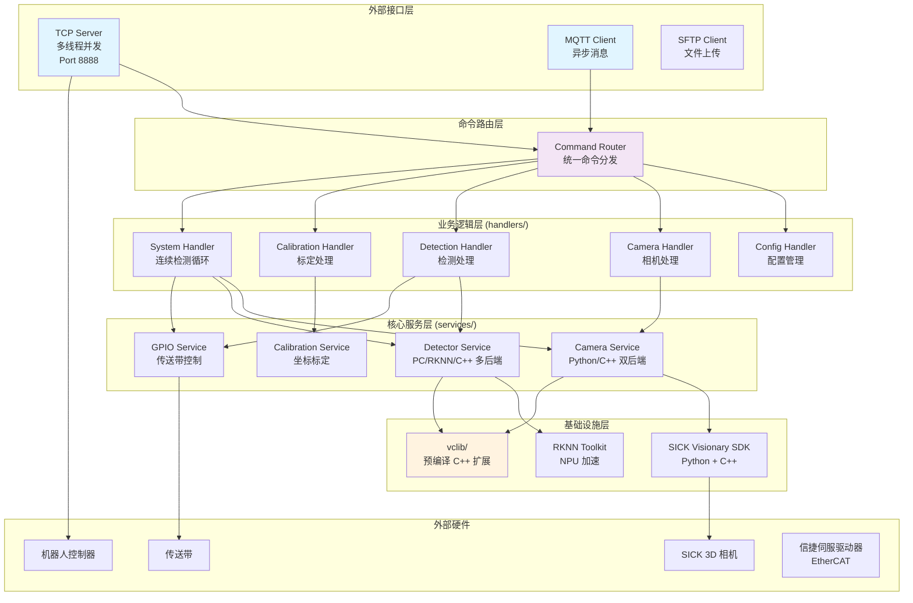
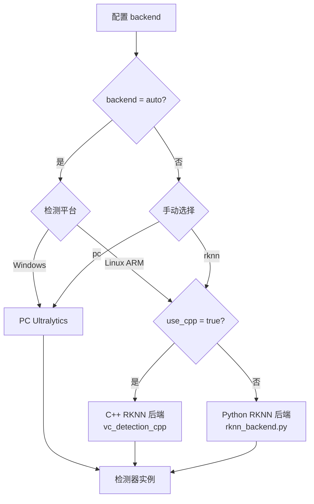

# VisionCore Enterprise Edition

**企业级工业视觉检测系统** - 高性能、模块化、多线程、跨平台架构

[](LICENSE)
[](https://www.python.org/)
[]()

---

## 📖 目录

- [概述](#概述)
- [核心特性](#核心特性)
- [系统架构](#系统架构)
- [目录结构](#目录结构)
- [核心模块详解](#核心模块详解)
- [支持的命令](#支持的命令)
- [快速开始](#快速开始)
- [配置说明](#配置说明)
- [部署指南](#部署指南)
- [开发指南](#开发指南)
- [性能指标](#性能指标)
- [故障排除](#故障排除)
- [更新日志](#更新日志)
- [许可证](#许可证)

---

## 概述

VisionCore Enterprise Edition 是一套**企业级工业视觉检测系统**，采用清晰的分层架构、模块化设计、多线程并发处理，专为工业自动化场景打造。

### 设计理念

- **分层清晰**: 严格的领域驱动设计（DDD），通讯层、业务逻辑层、服务层完全解耦
- **跨平台支持**: 同时支持 Windows PC、Linux x86_64 和 ARM (RK3588) 平台
- **多后端引擎**: AI检测和相机均支持 Python/C++ 双后端，自动选择最优实现
- **高可用性**: 多线程健康监控、自动重连、故障自动恢复
- **实时控制**: 支持连续检测循环、GPIO传送带控制、EtherCAT伺服控制

### 应用场景

- 🏭 **工业自动化**: 产品缺陷检测、分拣、定位
- 🤖 **机器人引导**: 视觉定位、坐标标定、抓取引导
- 📦 **物流分拣**: 包裹识别、尺寸测量、位置检测
- 🔍 **质量检验**: 产品外观检测、尺寸测量、缺陷识别

---

## 核心特性

### 🎥 多相机支持

| 特性 | 说明 |
|------|------|
| **SICK 3D相机** | 完整 SICK Visionary SDK 集成，支持深度图、强度图、相机参数获取 |
| **双后端架构** | Python SDK 后端 + C++ 高性能后端（`vc_camera_cpp`） |
| **自动重连** | 断线自动重连机制，保证系统稳定性 |
| **预热机制** | 首次取图预热，减少实际检测延迟 |
| **帧号验证** | 检测旧帧复用问题（ARM平台特有），自动重试获取新帧 |

### 🧠 AI 检测引擎

| 后端 | 平台 | 说明 |
|------|------|------|
| **PC Ultralytics** | Windows/Linux x86 | 基于 Ultralytics YOLO，支持分割模型 |
| **RKNN Python** | Linux ARM (RK3588) | RKNN-Toolkit2 Python 推理 |
| **RKNN C++** | Linux ARM (RK3588) | C++ 实现（`vc_detection_cpp`），更高性能 |

**特性**:
- 工厂模式自动选择最优后端（`backend: auto`）
- 置信度、NMS阈值可配置
- 预热推理避免首次检测延迟
- 支持实例分割（Mask）

### 📡 双通信协议

| 协议 | 特性 |
|------|------|
| **TCP 服务器** | 多线程并发、多客户端支持、心跳检测、高性能 `catch` 命令 |
| **MQTT 客户端** | 独立线程、远程命令控制、QoS 2 可靠传输 |

### 🔄 实时抓取控制系统

VisionCore 支持**连续检测循环模式**，适用于传送带自动分拣场景：

```
┌─────────────────────────────────────────────────────────────┐
│  连续检测循环 (start 命令启动)                               │
│                                                             │
│  ┌──────┐   ┌──────┐   ┌───────┐   ┌──────┐   ┌──────────┐ │
│  │ 取图 │ → │ 检测 │ → │ GPIO  │ → │ 坐标 │ → │ TCP发送  │ │
│  │      │   │      │   │ 控制  │   │ 计算 │   │ (机器人) │ │
│  └──────┘   └──────┘   └───────┘   └──────┘   └──────────┘ │
│                ↓                                            │
│        ┌─────────────────┐                                  │
│        │ 等待 complete   │ ← 机器人抓取完成后发送            │
│        │ 消息后继续发送   │                                  │
│        └─────────────────┘                                  │
└─────────────────────────────────────────────────────────────┘
```

**特性**:
- GPIO 传送带控制（ROI 内有目标时停止传送带）
- 物体稳定等待机制（传送带停止后等待物体稳定）
- 机器人抓取状态管理（等待 `complete` 消息后继续发送）
- 多 ROI 优先级选择

### ⚡ EtherCAT 伺服控制 (SOEM 模块)

基于 **PySOEM** 的 EtherCAT 主站实现，支持 **信捷 DS5C1S 伺服驱动器**：

| 特性 | 说明 |
|------|------|
| **协议** | EtherCAT CoE (CANopen over EtherCAT) |
| **标准** | CiA 402 设备规范 |
| **模式** | 速度模式 (PV)、位置模式 (PP) |
| **参数** | 17位编码器、最大 3000 RPM |

```python
from soem import EtherCATMaster, XinJeDS5C1S, ServoMode

master = EtherCATMaster("\\Device\\NPF_{GUID}")
master.open()
master.scan_slaves()

servo = XinJeDS5C1S(master, slave_index=0, pdo_mode='velocity')
servo.set_mode(ServoMode.PROFILE_VELOCITY)
master.set_operational()
master.start_cycle(0.001)  # 1ms 循环

servo.set_target_velocity(1000)  # 1000 RPM
```

### 📐 坐标标定系统

**两步标定工作流**:

1. **`get_calibrat_image`**: 检测12个黑块，返回世界坐标
2. **`coordinate_calibration`**: 接收机器人坐标，执行标定计算

**特性**:
- 12点标定（3×4 网格布局）
- 多种二值化策略（Otsu、自适应阈值、CLAHE）
- XY 仿射 + Z 线性变换模型
- 精度验证（RMSE、质量评级）

---

## 系统架构

### 整体架构图



### 检测后端选择流程



---

## 目录结构

```
VisualCoreEnterpriseEdition/
│
├── app/                                    # 应用入口层
│   ├── main.py                            # 主程序入口
│   └── bootstrap.py                       # 启动引导和依赖注入
│
├── domain/                                 # 领域模型层（DDD）
│   ├── enums/                             
│   │   └── commands.py                    # 命令枚举（VisionCoreCommands）
│   └── models/                            
│       └── mqtt.py                        # MQTT响应模型
│
├── handlers/                               # 业务逻辑层 - 命令处理器
│   ├── context.py                         # 命令上下文（依赖注入容器）
│   ├── config.py                          # 配置管理命令处理器
│   ├── camera.py                          # 相机命令处理器
│   ├── detection.py                       # 检测命令处理器 (model_test, catch)
│   ├── calibration.py                     # 标定命令处理器
│   └── system.py                          # 系统命令 (start/stop 连续检测循环)
│
├── services/                               # 核心服务层
│   ├── camera/                            # 相机服务
│   │   ├── sick_camera.py                 # SICK Python 后端
│   │   ├── cpp_camera.py                  # C++ 后端封装
│   │   └── hik_tof.py                     # HIK ToF 相机（预留）
│   │
│   ├── detection/                         # 检测服务
│   │   ├── base.py                        # 检测器抽象基类
│   │   ├── factory.py                     # 检测器工厂（自动选择后端）
│   │   ├── pc_ultralytics.py             # PC 端 Ultralytics 检测器
│   │   ├── rknn_backend.py               # RKNN Python 后端
│   │   ├── cpp_backend.py                # RKNN C++ 后端封装
│   │   ├── coordinate_processor.py        # 坐标处理器（像素→世界坐标）
│   │   ├── target_selector.py             # 目标选择器（多 ROI 优先级）
│   │   ├── roi_processor.py               # ROI 处理器
│   │   └── visualizer.py                  # 可视化工具
│   │
│   ├── calibration/                       # 标定服务
│   │   ├── black_block_detector.py        # 黑块检测器
│   │   └── calibrator.py                  # 标定计算器
│   │
│   ├── comm/                              # 通信服务
│   │   ├── tcp_server.py                  # TCP 多线程服务器
│   │   ├── mqtt_client.py                 # MQTT 客户端
│   │   ├── comm_manager.py                # 通信管理器
│   │   └── command_router.py              # 命令路由器
│   │
│   ├── servo/                             # GPIO 控制服务
│   │   └── gpio.py                        # GPIO 输出控制（传送带）
│   │
│   ├── sftp/                              # SFTP 服务
│   │   └── sftp_client.py                 # SFTP 客户端
│   │
│   ├── shared/                            # 共享工具
│   │   ├── image_utils.py                 # 图像处理工具
│   │   ├── sftp_helper.py                 # SFTP 辅助工具
│   │   └── calibration_utils.py           # 标定坐标转换工具
│   │
│   ├── system/                            # 系统服务
│   │   ├── initializer.py                 # 系统初始化器
│   │   ├── monitor.py                     # 系统监控器（多线程）
│   │   └── log_manager.py                 # 日志管理器
│   │
│   └── cpp/                               # C++ 扩展源码
│       ├── CMakeLists.txt                 # 主 CMake 配置
│       ├── camera/                        # 相机 C++ 模块
│       │   ├── VisionaryCameraLib.cpp    # SICK 相机封装
│       │   └── bindings.cpp              # pybind11 绑定
│       └── detection/                     # 检测 C++ 模块
│           ├── RKNNDetector.cpp          # RKNN 检测器
│           └── bindings.cpp              # pybind11 绑定
│
├── vclib/                                  # 预编译 C++ 扩展库
│   ├── x86/                               # Windows x86_64
│   │   ├── vc_camera_cpp.pyd             # 相机模块
│   │   └── vc_detection_cpp.pyd          # 检测模块
│   └── aarch/                             # Linux ARM64 (RK3588)
│       ├── vc_camera_cpp.so              # 相机模块
│       └── vc_detection_cpp.so           # 检测模块
│
├── soem/                                   # EtherCAT 主站模块
│   ├── ethercat_master.py                 # EtherCAT 主站实现
│   ├── servo_drive.py                     # CiA 402 伺服驱动器基类
│   ├── xinje_servo.py                     # 信捷 DS5C1S 伺服实现
│   └── examples/                          # 使用示例
│
├── infrastructure/                         # 基础设施层
│   ├── sick/                              # SICK SDK Python 封装
│   ├── sick_visionary_cpp_shared/         # SICK Visionary C++ SDK
│   └── yolov8-seg-thread-stream/          # YOLOv8 多线程检测参考
│
├── configs/                                # 配置文件
│   ├── config.yaml                        # 主配置文件
│   ├── transformation_matrix.json         # 坐标变换矩阵
│   └── warmup_image.jpg                   # 预热图像
│
├── models/                                 # AI 模型文件
│   ├── *.pt                               # PyTorch 模型（PC 端）
│   └── *.rknn                             # RKNN 模型（ARM 端）
│
├── docker/                                 # Docker 部署配置
│   ├── Dockerfile                         # 标准 Docker 镜像
│   ├── Dockerfile.gpu                     # GPU 加速镜像
│   ├── Dockerfile.rk3588                  # RK3588 镜像
│   └── docker-compose.*.yml               # 编排配置
│
├── scripts/                                # 运维脚本
├── tests/                                  # 测试脚本
├── logs/                                   # 日志文件
├── debug/                                  # 调试输出
│
├── requirements.txt                        # Python 依赖
├── LICENSE                                 # MIT 许可证
└── README.md                               # 本文档
```

---

## 核心模块详解

### 1. 相机模块 (services/camera/)

支持两种后端：

```python
# Python 后端（兼容性好）
from services.camera.sick_camera import SickCamera
camera = SickCamera(ip="192.168.2.99", port=2122)

# C++ 后端（高性能，推荐）
from services.camera.cpp_camera import CppCamera
camera = CppCamera(ip="192.168.2.99", port=2122)

# 获取数据
frame = camera.get_frame(depth=True, intensity=True, camera_params=True)
# 返回: {
#   'intensity_image': np.ndarray,    # 强度图像 256x256
#   'depthmap': np.ndarray,            # 深度图 256x256
#   'cameraParams': {...},             # 相机参数
#   'frame_num': int,                  # 帧号
#   'timestamp_ms': int                # 时间戳
# }
```

### 2. 检测模块 (services/detection/)

```python
from services.detection.factory import create_detector

# 自动选择最优后端
detector = create_detector(config)
detector.load()

# 执行检测
results = detector.detect(image)
# 返回: List[DetectionResult]
# 每个结果包含: xmin, ymin, xmax, ymax, class_id, score, seg_mask
```

**后端选择逻辑**:
- Windows → PC Ultralytics
- Linux ARM + `use_cpp: true` → C++ RKNN
- Linux ARM + `use_cpp: false` → Python RKNN

### 3. GPIO 控制 (services/servo/)

用于控制传送带启停：

```python
from services.servo.gpio import GPIO

gpio = GPIO()
gpio.open(chip="/dev/gpiochip3", pin=20, consumer="conveyor")

gpio.high()  # 传送带运行
gpio.low()   # 传送带停止
```

### 4. 连续检测循环 (handlers/system.py)

通过 `start` 命令启动连续检测：

```python
# 循环流程:
while running:
    # 1. 取图
    frame = camera.get_frame()
    
    # 2. 检测
    detections = detector.detect(frame['intensity_image'])
    
    # 3. GPIO 控制 (每个 ROI 独立)
    for roi in rois:
        count = count_in_roi(detections, roi)
        if count > 0:
            gpio[roi].low()   # 有目标，停止传送带
        else:
            gpio[roi].high()  # 无目标，继续运行
    
    # 4. 坐标计算和发送 (等待机器人 complete 后才发送下一个)
    if best_target and not is_robot_picking:
        coords = calculate_robot_coords(best_target)
        tcp_send(coords)
        is_robot_picking = True  # 等待 complete
```

### 5. EtherCAT 伺服控制 (soem/)

```python
from soem import EtherCATMaster, XinJeDS5C1S, ServoMode

# 初始化主站
master = EtherCATMaster("\\Device\\NPF_{GUID}")
master.open()
slave_count = master.scan_slaves()
master.config_map()

# 创建伺服对象
servo = XinJeDS5C1S(master, slave_index=0, pdo_mode='velocity')
servo.set_mode(ServoMode.PROFILE_VELOCITY)

# 进入运行状态
master.set_operational()
master.start_cycle(0.001)  # 1ms 周期

# 控制速度
servo.enable()
servo.set_target_velocity(1000)  # 1000 RPM

# 停止
servo.set_target_velocity(0)
master.close()
```

---

## 支持的命令

### MQTT/TCP 命令

| 命令 | 功能 | 说明 |
|------|------|------|
| `get_config` | 获取系统配置 | 返回完整配置和模型列表 |
| `save_config` | 保存系统配置 | 自动备份，支持热更新 |
| `get_image` | 获取相机图像 | 返回图像 + SFTP 上传信息 |
| `model_test` | 测试 AI 模型 | 检测数量 + 推理时间 + 可视化 |
| `get_calibrat_image` | 获取标定图像 | 12个黑块世界坐标 |
| `coordinate_calibration` | 执行坐标标定 | 计算变换矩阵 + RMSE |
| `catch` | 单次检测抓取 | 返回机器人坐标 |
| `start` | 启动连续检测 | GPIO 控制 + 循环检测 |
| `stop` | 停止连续检测 | 释放资源 |

### TCP 响应格式

**catch 命令**:
```
p1_count,p2_count,x,y,z
```
- `p1_count`: P1 ROI 内目标数量
- `p2_count`: P2 ROI 内目标数量
- `x,y,z`: 机器人坐标（mm）

**start 连续模式**:
```
x,y,z
```
- 直接返回坐标，由机器人发送 `complete` 表示抓取完成

**错误码**:
- `0,0,0,0,0`: 未检测到目标
- `E1,...`: 相机/检测器未就绪

---

## 快速开始

### 环境要求

| 项目 | 要求 |
|------|------|
| Python | 3.8+ |
| Windows | 10+ |
| Linux | Ubuntu 18.04+ / Debian 11+ |
| ARM | RK3588 (RKNN Runtime) |
| 相机 | SICK Visionary 系列 |

### 安装依赖

```bash
# 克隆项目
git clone <repository-url>
cd VisualCoreEnterpriseEdition

# 安装 Python 依赖
pip install -r requirements.txt

# 主要依赖
pip install opencv-python ultralytics paho-mqtt numpy pyyaml paramiko

# ARM 平台额外依赖
pip install rknn-toolkit2  # 从 Rockchip 官方获取
```

### 运行系统

```bash
# 开发模式
python -m app.main

# 输出示例:
# VisionCorePro starting...
# ✓ C++库路径准备完成 | vclib/x86
# ✓ TCP服务器启动成功 | 192.168.2.90:8888
# ✓ 相机连接成功 | 192.168.2.99:2122
# ✓ 相机预热完成 | 耗时=145.2ms
# ✓ 检测器加载成功 | 后端: pc
# ✓ 检测器预热完成 | 耗时=234.5ms | 检测数=2
# ✓ 系统启动完成 | 关键组件全部就绪
```

---

## 配置说明

### 主配置文件 (configs/config.yaml)

```yaml
# 日志配置
logging:
  enable: true
  level: INFO
  console:
    enable: true
  file:
    enable: true
    path: logs
    backup_count: 30

# 监控配置
board_mode:
  retry_delay: 5           # 重试延迟（秒）
  monitoring:
    check_interval: 30     # 健康检查间隔
    failure_threshold: 1   # 失败阈值

# 相机配置
camera:
  enable: true
  backend: cpp            # cpp | sick (自动选择 C++ 后端)
  connection:
    ip: 192.168.2.99
    port: 2122
  mode:
    useSingleStep: true

# 检测模型配置
model:
  backend: auto           # auto | pc | rknn
  use_cpp: true           # RKNN 时使用 C++ 后端
  
  # 平台特定配置
  windows:
    path: models/seasoning.pt
  aarch:
    path: models/seasoning.rknn
  
  conf_threshold: 0.75
  nms_threshold: 0.65

# TCP 服务器
DetectionServer:
  enable: true
  host: 192.168.2.90
  port: 8888
  max_connections: 15
  heartbeat_interval: 30

# ROI 配置（多 ROI 优先级）
roi:
  enable: true
  minArea: 3000           # 最小面积阈值
  depthThreshold: 665     # 深度阈值
  stabilityWaitTime: 0.15 # 物体稳定等待时间
  
  regions:
    - name: main_work_area
      width: 150
      height: 100
      offsetx: 0
      offsety: 30
      priority: 1         # 优先级最高
      gpio:
        enable: true
        chip: /dev/gpiochip3
        pin: 20
    
    - name: backup_area
      width: 150
      height: 100
      offsetx: 90
      offsety: 140
      priority: 2

# SFTP（可选）
sftp:
  enable: false
  host: 192.168.2.126
  port: 22
  username: qt
  password: '123456'
```

---

## 部署指南

### Linux 系统服务

```bash
# 安装到系统目录
sudo cp -r . /opt/VisionCoreEE
cd /opt/VisionCoreEE
sudo pip3 install -r requirements.txt

# 配置 systemd 服务
sudo cp scripts/visioncore.service /etc/systemd/system/
sudo systemctl daemon-reload
sudo systemctl enable visioncore
sudo systemctl start visioncore

# 查看状态
sudo systemctl status visioncore
sudo journalctl -u visioncore -f
```

### Docker 部署

```bash
# 构建镜像
cd docker
docker build -t visioncore:latest -f Dockerfile ..

# RK3588 平台
docker build -t visioncore:rk3588 -f Dockerfile.rk3588 ..

# 运行
docker-compose up -d
```

### Windows 服务

使用 NSSM (Non-Sucking Service Manager):

```cmd
nssm install VisionCoreEE "C:\Python38\python.exe" "C:\VisionCoreEE\app\main.py"
nssm start VisionCoreEE
```

---

## 性能指标

| 指标 | 数值 | 说明 |
|------|------|------|
| TCP 响应延迟 | < 200ms | 单次 catch 命令 |
| 连续检测周期 | 10ms | start 模式循环间隔 |
| 检测速度 (PC) | 30-50 FPS | NVIDIA RTX 系列 |
| 检测速度 (RKNN C++) | 15-25 FPS | RK3588 NPU |
| 相机取图 | 100-150ms | SICK 3D 单帧 |
| 坐标计算 | < 5ms | 像素→机器人坐标 |
| 内存占用 | < 500MB | 正常运行时 |
| 标定精度 | XY: 2-3mm, Z: 3-5mm | 12点标定 |

---

## 故障排除

### Q1: 相机连接失败

```bash
# 测试网络连通性
ping 192.168.2.99
telnet 192.168.2.99 2122

# 检查防火墙
sudo ufw status
```

### Q2: C++ 模块加载失败

```
# 检查 vclib 目录
ls vclib/x86/  # Windows
ls vclib/aarch/  # Linux ARM

# 确认 Python 版本匹配
python --version  # 需要与编译时一致
```

### Q3: RKNN 推理失败

```bash
# 检查 RKNN Runtime
cat /proc/rknn/version

# 确认 NPU 可用
ls /dev/dri/
```

### Q4: GPIO 控制无效

```bash
# 检查 GPIO 权限
ls -la /dev/gpiochip*
sudo usermod -aG gpio $USER

# 测试 GPIO
python -c "from services.servo.gpio import GPIO; g = GPIO(); g.open('/dev/gpiochip3', 20); g.high()"
```

---

## 更新日志

### v1.3.0 (2025-12)

#### 🚀 新增功能

- ✅ **连续检测循环**: `start`/`stop` 命令，支持传送带自动分拣
- ✅ **GPIO 传送带控制**: 多 ROI 独立 GPIO 控制
- ✅ **机器人抓取状态管理**: 等待 `complete` 消息机制
- ✅ **物体稳定等待**: 传送带停止后自动等待物体稳定
- ✅ **深度增量计数**: 基于深度阈值的物体计数增量

#### 🔧 改进

- 📈 C++ 后端性能优化
- 🛡️ 帧号验证防止旧帧复用（ARM 平台）
- 📋 详细的循环日志输出

### v1.2.0 (2025-11)

- ✅ 分层架构优化
- ✅ handlers 从 services/comm 独立
- ✅ 业务逻辑层与通讯层完全解耦

### v1.1.0 (2025-11)

- ✅ 多线程架构重构
- ✅ TCP 多客户端支持
- ✅ 独立监控线程

---

## 许可证

本项目采用 MIT 许可证 - 详见 [LICENSE](LICENSE) 文件

---

## 致谢

- [Ultralytics YOLO](https://github.com/ultralytics/ultralytics) - 检测引擎
- [SICK AG](https://www.sick.com/) - SICK Visionary SDK
- [PySOEM](https://github.com/bnjmnp/pysoem) - EtherCAT 主站库
- [Paho MQTT](https://www.eclipse.org/paho/) - MQTT 客户端
- [OpenCV](https://opencv.org/) - 图像处理

---

<div align="center">

**Built with ❤️ for Industrial Automation**

**流程图预览插件推荐：**
- VSCode: 安装 "Markdown Preview Mermaid Support"
- GitHub: 原生支持
- 在线预览: https://mermaid.live/

[⬆ 返回顶部](#visioncore-enterprise-edition)

</div>
