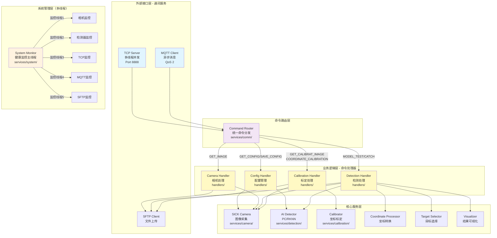
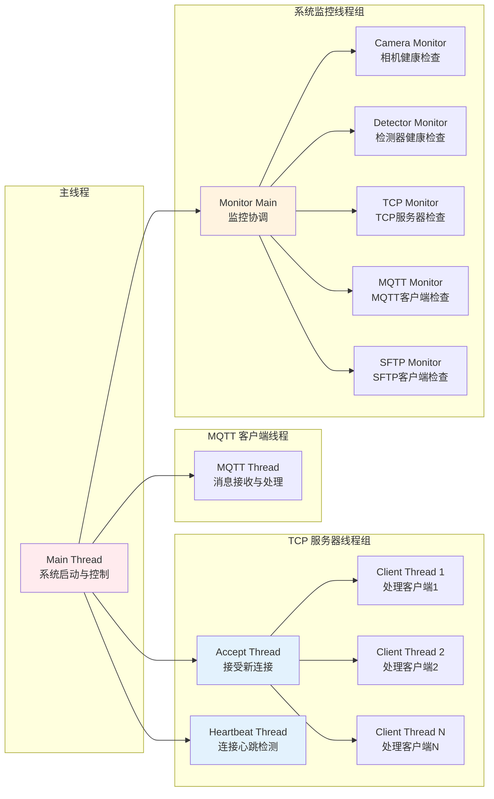
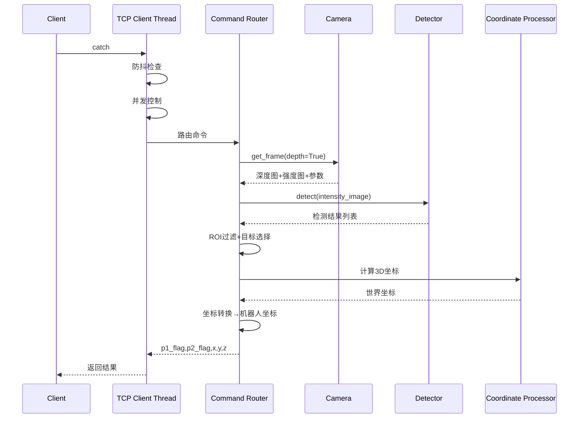
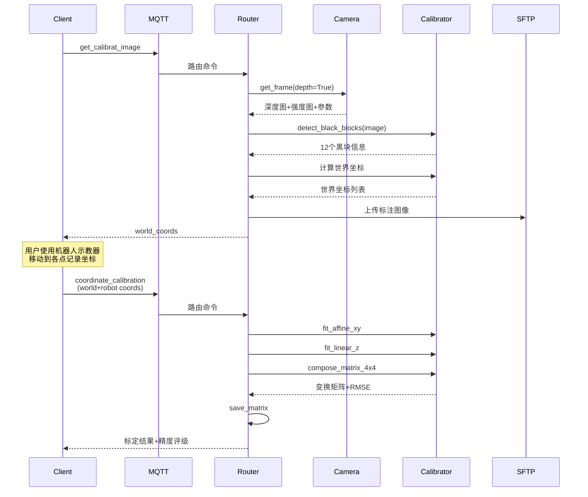
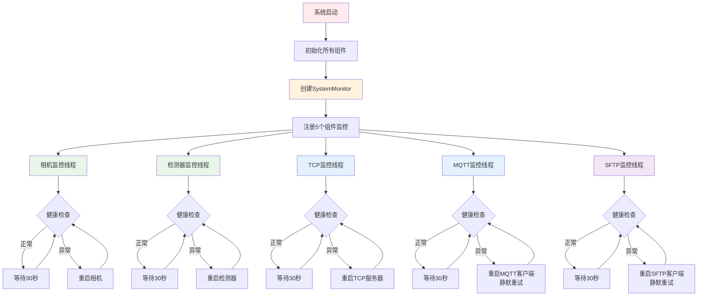

# VisionCore Enterprise Edition

**企业级工业视觉检测系统** - 高性能、模块化、多线程架构

[](LICENSE)
[](https://www.python.org/)
[]()

---

## 📖 目录

- [概述](#概述)
- [核心特性](#核心特性)
- [系统架构](#系统架构)
- [多线程架构](#多线程架构)
- [目录结构](#目录结构)
- [核心模块](#核心模块)
- [支持的命令](#支持的命令)
- [快速开始](#快速开始)
- [配置说明](#配置说明)
- [部署指南](#部署指南)
- [开发指南](#开发指南)
- [性能指标](#性能指标)
- [故障排除](#故障排除)
- [许可证](#许可证)

---

## 概述

VisionCore Enterprise Edition 是对原有 VisionCore 系统的**工程化重构版本**，采用清晰的分层架构、模块化设计、**多线程并发处理**，专为工业自动化场景打造的高性能视觉检测系统。

### 设计理念

- **分层清晰**: 严格的领域驱动设计（DDD），通讯层、业务逻辑层、服务层完全解耦
- **关注点分离**: handlers/ 负责业务逻辑，services/comm/ 仅负责通讯协议
- **多线程架构**: TCP 多客户端并发、MQTT 异步处理、组件独立监控
- **可测试性**: 模块化设计，支持单元测试和集成测试
- **可扩展性**: 工厂模式、策略模式，易于添加新功能
- **可维护性**: 代码结构清晰，文档完善，注释详细
- **高可用性**: 多线程健康监控、自动重连、故障自动恢复

### 应用场景

- 🏭 **工业自动化**: 产品缺陷检测、分拣、定位
- 🤖 **机器人引导**: 视觉定位、坐标标定、抓取引导
- 📦 **物流分拣**: 包裹识别、尺寸测量、位置检测
- 🔍 **质量检验**: 产品外观检测、尺寸测量、缺陷识别

---

## 核心特性

### 🎥 多相机支持

- **SICK 3D相机**: 完整的 SICK SDK 集成，支持深度图像、强度图像和相机参数获取
- **C++ 相机接口**: 高性能C++封装，支持帧号验证和自动重试
- **HIK ToF相机**: 支持海康威视ToF 3D相机（待完整集成）
- **自动重连**: 断线自动重连机制，保证系统稳定性
- **预热机制**: 首次取图预热，减少实际检测延迟
- **帧号验证**: 自动检测并重试旧帧复用问题（特别针对ARM平台优化）

### 🧠 AI 检测引擎

- **Ultralytics YOLO**: PC端高性能检测（支持分割模型）
- **RKNN 推理**: 嵌入式平台加速（RK3588/RK3566等）
- **C++ 高性能后端**: 
  - C++实现的相机接口和检测器（更快的推理速度）
  - 支持PC和RKNN双平台
  - 自动回退机制（C++不可用时降级到Python实现）
- **工厂模式**: 自动选择最优后端（PC/RKNN/Auto）
- **灵活配置**: 置信度、NMS阈值可调
- **预热推理**: 模型加载后预热推理，避免首次检测延迟

### 📡 双通信协议（多线程）

- **TCP 服务器**: 
  - 多线程并发处理，支持多客户端同时连接
  - 每个客户端独立线程，互不干扰
  - 心跳检测线程，自动清理超时连接
  - 高性能 `catch` 命令，实时检测响应（< 200ms）
- **MQTT 客户端**: 
  - 独立线程处理消息
  - 远程命令控制（QoS 2，确保消息可靠送达）
- **命令路由**: 统一的命令分发机制，易于扩展新命令
- **优雅降级**: TCP为关键组件，MQTT为非关键组件

### 📐 坐标标定系统

- **黑块检测**: 鲁棒的黑色标记块检测算法（12点标定，3x4网格布局）
- **多种二值化策略**: Otsu、自适应阈值、CLAHE增强
- **质量评分系统**: 基于形状、对比度、实心度的质量评分
- **两步工作流**: 
  1. `get_calibrat_image` - 检测黑块并返回世界坐标
  2. `coordinate_calibration` - 接收机器人坐标并执行标定
- **XY仿射 + Z线性**: 分离的变换模型，适合工业场景
- **精度验证**: 自动计算 RMSE，质量评级（优秀/良好/合格/需改进）

### 🤖 智能遮挡检测

- **时间间隔检测**: 基于TCP请求间隔判断机器人动作
- **智能忽略机制**: 机器人执行抓取动作期间自动忽略N次检测
- **防止误触发**: 避免机器人动作期间误触发皮带移动信号
- **可配置参数**: 间隔阈值和忽略次数可灵活配置

### 🔧 系统管理（多线程监控）

- **多线程健康监控**: 
  - 每个组件独立监控线程
  - 定时健康检查（默认30秒）
  - 异常自动重启
- **分级启动策略**: 
  - 关键组件（相机、检测器、TCP）：主线程阻塞重试直到成功
  - 非关键组件（MQTT、SFTP）：允许失败，后台静默重试
- **自动重启**: 组件级故障自动恢复机制
- **日志系统**: 分级日志（INFO/DEBUG/ERROR）、按日轮转、控制台+文件输出
- **配置管理**: 支持获取和保存配置（带备份）

### 📁 文件传输

- **SFTP 客户端**: 自动上传检测图像、标定图像、测试图像
- **断线重连**: 自动重连机制，保证传输可靠性
- **静默重试**: 作为非关键组件，连接失败时静默后台重试
- **路径前缀**: 支持配置远程路径前缀，便于文件管理

---

## 系统架构

### 整体架构图



---

## 架构设计说明

### 分层架构优势

VisionCore Enterprise Edition 采用清晰的四层架构设计：

#### 1. **领域层 (domain/)**
- 定义核心业务概念和枚举
- 独立于技术实现细节
- 可复用的领域模型

#### 2. **业务逻辑层 (handlers/)**
- **职责**: 专注于业务逻辑处理，不关心通讯协议
- **特点**: 
  - 与通讯层完全解耦
  - 通过 CommandContext 依赖注入获取服务
  - 纯函数式命令处理器，易于测试
- **文件**:
  - `context.py` - 命令上下文（依赖注入容器）
  - `config.py` - 配置管理业务逻辑
  - `camera.py` - 相机操作业务逻辑
  - `detection.py` - 检测业务逻辑
  - `calibration.py` - 标定业务逻辑

#### 3. **服务层 (services/)**
- **通讯服务 (services/comm/)**: 
  - 仅负责TCP/MQTT协议处理
  - 命令路由和分发
  - 不包含业务逻辑
- **核心服务**: 
  - 相机服务、检测服务、标定服务
  - SFTP文件传输服务
  - 系统监控和日志服务
- **共享工具**: 
  - 图像处理、坐标转换等工具类

#### 4. **基础设施层 (infrastructure/)**
- 第三方SDK封装
- 硬件驱动适配

### 关注点分离的好处

```
┌─────────────────────────────────────────────────────────┐
│  外部请求 (TCP/MQTT)                                     │
└────────────────┬────────────────────────────────────────┘
                 │
                 ▼
┌─────────────────────────────────────────────────────────┐
│  通讯层 (services/comm/)                                 │
│  - tcp_server.py      处理TCP协议                        │
│  - mqtt_client.py     处理MQTT协议                       │
│  - command_router.py  路由命令到handlers                 │
└────────────────┬────────────────────────────────────────┘
                 │ 路由
                 ▼
┌─────────────────────────────────────────────────────────┐
│  业务逻辑层 (handlers/)                                  │
│  - 不关心是TCP还是MQTT请求                               │
│  - 专注于业务规则和流程                                   │
│  - 调用服务层完成具体功能                                 │
└────────────────┬────────────────────────────────────────┘
                 │ 调用
                 ▼
┌─────────────────────────────────────────────────────────┐
│  服务层 (services/)                                      │
│  - camera/      相机硬件操作                             │
│  - detection/   AI检测推理                               │
│  - calibration/ 坐标标定计算                             │
│  - sftp/        文件上传                                 │
└─────────────────────────────────────────────────────────┘
```

**优势**:
1. **易于测试**: handlers可以独立测试，无需启动TCP/MQTT服务
2. **易于扩展**: 添加新协议（如WebSocket）只需修改通讯层，无需改动业务逻辑
3. **代码复用**: 同一个handler可以被TCP、MQTT、REST API等多种协议复用
4. **职责清晰**: 每层职责明确，降低耦合度
5. **维护性强**: 修改业务逻辑不影响通讯层，修改通讯协议不影响业务逻辑

---

## 多线程架构

### 线程模型

系统采用**多线程并发架构**，提高响应速度和系统稳定性：



### 线程说明

| 线程类型 | 数量 | 守护线程 | 功能描述 |
|---------|------|---------|----------|
| 主线程 | 1 | 否 | 系统启动、初始化、信号处理 |
| TCP Accept线程 | 1 | 是 | 监听并接受新的TCP连接 |
| TCP Heartbeat线程 | 1 | 是 | 定期检查客户端心跳，清理超时连接 |
| TCP Client线程 | N | 是 | 每个TCP客户端独立线程，处理命令 |
| MQTT线程 | 1 | 是 | 接收和处理MQTT消息 |
| Monitor主线程 | 1 | 否 | 协调各组件监控 |
| 组件监控线程 | 5 | 是 | 分别监控相机、检测器、TCP、MQTT、SFTP |

---

## 目录结构

```
VisualCoreEnterpriseEdition/
│
├── app/                                    # 应用入口层
│   ├── main.py                            # 主程序入口
│   └── bootstrap.py                       # 启动引导和依赖注入
│
├── domain/                                 # 领域模型层（DDD）
│   ├── enums/                             
│   │   └── commands.py                    # 命令枚举（VisionCoreCommands）
│   └── models/                            
│       └── mqtt.py                        # MQTT响应模型
│
├── handlers/                               # 业务逻辑层 - 命令处理器
│   ├── __init__.py                        
│   ├── context.py                         # 命令上下文（依赖注入容器）
│   ├── config.py                          # 配置管理命令处理器
│   ├── camera.py                          # 相机命令处理器
│   ├── detection.py                       # 检测命令处理器
│   └── calibration.py                     # 标定命令处理器
│
├── services/                               # 核心服务层
│   ├── camera/                            # 相机服务
│   │   ├── sick_camera.py                 # SICK 3D相机（Python实现）
│   │   ├── cpp_camera.py                  # SICK 3D相机（C++封装）
│   │   ├── hik_tof.py                     # HIK ToF相机（待集成）
│   │   └── vc_camera_cpp.pyd              # C++相机模块（编译后）
│   │
│   ├── detection/                         # 检测服务
│   │   ├── base.py                        # 检测器接口
│   │   ├── factory.py                     # 检测器工厂
│   │   ├── pc_ultralytics.py             # PC端Ultralytics检测器
│   │   ├── rknn_backend.py               # RKNN推理后端（Python）
│   │   ├── cpp_backend.py                 # RKNN推理后端（C++封装）
│   │   ├── coordinate_processor.py        # 坐标处理器
│   │   ├── target_selector.py             # 目标选择器
│   │   ├── visualizer.py                  # 可视化工具
│   │   └── roi_processor.py               # ROI处理器
│   │
│   ├── calibration/                       # 标定服务
│   │   ├── black_block_detector.py        # 黑块检测器
│   │   └── calibrator.py                  # 标定计算器
│   │
│   ├── cpp/                               # C++模块构建系统
│   │   ├── camera/                        # 相机C++源码
│   │   ├── detection/                     # 检测C++源码
│   │   ├── build/                         # CMake构建目录
│   │   └── dist/                          # 编译产物（.pyd/.so）
│   │
│   ├── comm/                              # 通信服务（纯通讯层）
│   │   ├── tcp_server.py                  # TCP服务器（多线程）
│   │   ├── mqtt_client.py                 # MQTT客户端
│   │   ├── comm_manager.py                # 通信管理器
│   │   └── command_router.py              # 命令路由器
│   │
│   ├── sftp/                              # SFTP服务
│   │   └── sftp_client.py                 
│   │
│   ├── shared/                            # 共享工具
│   │   ├── image_utils.py                 # 图像处理工具
│   │   └── sftp_helper.py                 # SFTP辅助工具
│   │
│   └── system/                            # 系统服务
│       ├── initializer.py                 # 系统初始化器
│       ├── monitor.py                     # 系统监控器（多线程）
│       └── log_manager.py                 # 日志管理器
│
├── infrastructure/                         # 基础设施层
│   ├── sick/                              # SICK SDK封装
│   └── Mv3dRgbdImport/                    # HIK ToF SDK封装
│
├── configs/                                # 配置文件
│   ├── config.yaml                        # 主配置文件
│   ├── transformation_matrix.json         # 坐标变换矩阵
│   └── warmup_image.jpg                   # 预热图像
│
├── models/                                 # AI模型文件
├── logs/                                   # 日志文件
├── debug/                                  # 调试输出
├── tests/                                  # 测试脚本
├── scripts/                                # 运维脚本
│
├── .gitignore                             
├── LICENSE                                
└── README.md                              
```

---

## 核心模块

### 1. TCP 服务器（多线程）

```python
from services.comm.tcp_server import TcpServer

# TCP服务器自动创建多个线程：
# - Accept线程：接受新连接
# - Heartbeat线程：心跳检测
# - Client线程：每个客户端一个独立线程

server = TcpServer(config, logger)
server.set_message_callback(handle_message)
server.start()
```

**线程安全特性**:
- 线程安全的客户端字典管理
- RLock 锁保护共享资源
- 优雅的线程退出机制

### 2. 系统监控器（多线程）

```python
from services.system.monitor import SystemMonitor

monitor = SystemMonitor(logger, check_interval=30)

# 注册组件监控（每个组件独立监控线程）
monitor.register("camera", 
                health_check=lambda: camera.healthy,
                restart_callback=restart_camera,
                is_critical=True)

monitor.start()  # 启动所有监控线程
```

**监控机制**:
- 每个组件独立监控线程
- 定期健康检查（默认30秒）
- 失败计数与自动重启
- 关键/非关键组件分级处理

### 3. 相机模块

```python
from services.camera.sick_camera import SickCamera

camera = SickCamera(
    ip="192.168.2.99", 
    port=2122, 
    use_single_step=True,
    logger=logger,
    login_attempts=[
        {"level": "service", "password": "123456"},
        {"level": "client", "password": "CLIENT"}
    ]
)
camera.connect()

# 获取所有数据
frame = camera.get_frame(depth=True, intensity=True, camera_params=True)
```

### 4. 检测模块

```python
from services.detection.factory import create_detector

# 自动选择最优后端
detector = create_detector(config)
results = detector.detect(image)
```

### 5. 标定模块

```python
from services.calibration import detect_black_blocks, calibrate_from_points

# 黑块检测
blocks = detect_black_blocks(image, max_blocks=12, rows=3, cols=4)

# 坐标标定
result = calibrate_from_points(
    world_points=[(xw1, yw1, zw1), ...],
    robot_points=[(xr1, yr1, zr1), ...],
    output_path="configs/transformation_matrix.json"
)
```

---

## 支持的命令

### MQTT 命令（远程控制）

| 命令 | 功能 | 参数 | 返回 |
|------|------|------|------|
| `get_config` | 获取系统配置 | - | 完整配置和模型列表 |
| `save_config` | 保存系统配置 | config对象 | 成功/失败（带备份） |
| `get_image` | 获取相机图像 | - | 图像+SFTP上传信息 |
| `model_test` | 测试AI模型 | - | 检测数量+推理时间+可视化图像 |
| `get_calibrat_image` | 获取标定图像 | - | 12个黑块的世界坐标+可视化图像 |
| `coordinate_calibration` | 执行坐标标定 | world_points, robot_points | 变换矩阵+RMSE+质量评级 |
| `catch` | 执行单次检测 | - | 检测结果+机器人坐标 |

### TCP 命令（实时检测）

| 命令 | 功能 | 返回格式 | 示例 |
|------|------|----------|------|
| `catch` | 执行单次检测 | `p1_flag,p2_flag,x,y,z` | `1,0,123.456,78.901,-45.123` |

**返回说明**:
- `1,0,123.456,78.901,-45.123`: 检测到目标（p1=1, p2=0, x, y, z坐标）
- `0,0,0,0,0`: 未检测到目标
- `-1,0,0,0,0`: 机器人遮挡（正在执行抓取动作）
- `E1,0,0,0,0`: 相机/检测器未就绪
- `E2,0,0,0,0`: 检测频率过高（防抖机制）
- `E3,0,0,0,0`: 正在处理中（并发控制）

---

## 快速开始

### 环境要求

- **Python**: 3.8+
- **操作系统**: Windows 10+ / Ubuntu 18.04+
- **硬件**: 
  - CPU: 4核以上
  - 内存: 8GB+
  - 相机: SICK 3D / HIK ToF

### 安装依赖

```bash
# 克隆项目
git clone <repository-url>
cd VisualCoreEnterpriseEdition

# 安装Python依赖
pip install -r requirements.txt

# 主要依赖
pip install opencv-python ultralytics paho-mqtt numpy pyyaml paramiko
```

### 配置文件

编辑 `configs/config.yaml`:

```yaml
# 日志配置
logging:
  enable: true
  level: INFO
  console:
    enable: true
  file:
    enable: true
    path: logs
    backup_count: 30

# 监控配置
board_mode:
  retry_delay: 5
  debug_warmup: false
  monitoring:
    check_interval: 30      # 健康检查间隔（秒）
    failure_threshold: 1    # 失败次数阈值

# 相机配置
camera:
  enable: true
  # backend: cpp           # 可选：cpp（高性能）| sick（Python实现）
  connection:
    ip: 192.168.2.99
    port: 2122
    timeout: 0
  mode:
    useSingleStep: true
  auth:
    loginAttempts:
      - level: service
        password: '123456'
      - level: client
        password: CLIENT

# 检测模型
model:
  backend: auto            # pc | rknn | auto
  use_cpp: true            # 启用C++后端（RKNN模式下提供更高性能）
  model_name: seasoning_11.18.pt
  path: models/seasoning_11.18.pt
  conf_threshold: 0.7
  nms_threshold: 0.6
  target: rk3588           # RKNN目标平台（rk3588/rk3566等）

# TCP服务器（多线程）
DetectionServer:
  enable: true
  host: 192.168.2.126
  port: 8888
  max_connections: 15      # 最大并发连接数
  buffer_size: 4096
  connection_timeout: 300
  heartbeat_interval: 30   # 心跳检测间隔

# MQTT配置
mqtt:
  enable: true
  connection:
    broker_host: 192.168.2.126
    broker_port: 1883
    client_id: visioncorepro
    keepalive: 60
  qos:
    subscribe: 2
  topics:
    subscribe:
      system_command: visual/system/command
    publish:
      message: visual/system/result

# ROI配置（多ROI优先级）
roi:
  enable: true
  minArea: 3000
  depthThreshold: 665      # 深度阈值（mm），用于过滤过深的目标
  # 机器人遮挡检测配置
  occlusion:
    intervalThreshold: 700 # TCP间隔阈值（ms），超过此值视为机器人正在执行抓取
    ignoreCount: 3         # 检测到间隔超过阈值后，接下来忽略的检测次数
  regions:
    - name: main_work_area
      shape: rectangle
      width: 150
      height: 100
      offsetx: 0
      offsety: 30
      priority: 1          # 优先级最高
    - name: backup_area
      shape: rectangle
      width: 150
      height: 100
      offsetx: 90
      offsety: 140
      priority: 2          # 优先级次之

# SFTP配置
sftp:
  enable: true
  host: 192.168.2.126
  port: 22
  username: qt
  password: '123456'
  remote_path: /
  prefix: D://Camera
  connection_timeout: 15
```

### 运行系统

```bash
# 开发模式
python -m app.main

# 系统将显示启动日志
# VisionCorePro starting...
# ✓ TCP服务器启动成功 | 192.168.2.126:8888
# ✓ 相机连接成功 | 192.168.2.99:2122
# ✓ 检测器加载成功 | 后端: auto
# ✓ MQTT连接成功 | 192.168.2.126
# ✓ SFTP连接成功 | 192.168.2.126
# ✓ 服务已启动，监控器正在运行
```

---

## 工作流程

### TCP catch 命令流程



### 坐标标定工作流程



### 多线程监控流程



---

## 性能指标

| 指标 | 数值 | 说明 |
|------|------|------|
| TCP响应延迟 | < 200ms | 单次检测平均响应时间 |
| TCP并发连接 | 15个 | 最大同时客户端数 |
| 检测速度（PC） | 30-50 FPS | GPU加速（NVIDIA RTX系列） |
| 检测速度（RKNN） | 15-25 FPS | RK3588 NPU加速 |
| 相机取图速度 | 100-150ms | SICK 3D相机单帧 |
| 内存占用 | < 500MB | 正常运行时 |
| 启动时间 | 5-10秒 | 包含预热的完整启动 |
| 监控线程数 | 5个 | 独立组件监控线程 |
| 健康检查间隔 | 30秒 | 可配置 |
| 标定精度 | XY: 2-3mm, Z: 3-5mm | 12点标定典型精度 |

**测试环境**:
- CPU: Intel Core i7-10700
- GPU: NVIDIA RTX 3060
- 内存: 16GB DDR4
- 操作系统: Windows 10 / Ubuntu 20.04

---

## 部署指南

### Linux 系统服务部署

```bash
# 1. 安装到系统目录
sudo cp -r . /opt/VisionCoreEE
cd /opt/VisionCoreEE
sudo pip3 install -r requirements.txt

# 2. 配置 systemd 服务
sudo cp scripts/visioncore.service /etc/systemd/system/
sudo systemctl daemon-reload
sudo systemctl enable visioncore
sudo systemctl start visioncore

# 3. 查看状态和日志
sudo systemctl status visioncore
sudo journalctl -u visioncore -f
```

### Windows 服务部署

使用 NSSM (Non-Sucking Service Manager):

```cmd
# 下载NSSM: https://nssm.cc/download
nssm install VisionCoreEE "C:\Python38\python.exe" "C:\VisionCoreEE\app\main.py"
nssm start VisionCoreEE
```

---

## 开发指南

### 添加新的MQTT命令

```python
# 1. 添加枚举 (domain/enums/commands.py)
class VisionCoreCommands(Enum):
    NEW_COMMAND = "new_command"

# 2. 创建处理器 (handlers/your_handler.py)
from handlers.context import CommandContext
from domain.models.mqtt import MQTTResponse
from domain.enums.commands import MessageType

def handle_new_command(req: MQTTResponse, ctx: CommandContext) -> MQTTResponse:
    # 访问注入的依赖
    logger = ctx.logger
    camera = ctx.camera
    detector = ctx.detector
    
    # 业务逻辑处理
    try:
        # ... 你的业务逻辑 ...
        return MQTTResponse(
            command=VisionCoreCommands.NEW_COMMAND.value,
            component="your_component",
            messageType=MessageType.SUCCESS,
            message="success",
            data={"result": "ok"}
        )
    except Exception as e:
        logger.error(f"handle_new_command error: {e}")
        return MQTTResponse(
            command=VisionCoreCommands.NEW_COMMAND.value,
            component="your_component",
            messageType=MessageType.ERROR,
            message=str(e),
            data={}
        )

# 3. 注册命令 (services/comm/command_router.py)
from handlers import your_handler

def register_default(self):
    self.register(VisionCoreCommands.NEW_COMMAND.value, 
                  lambda req: your_handler.handle_new_command(req, self._ctx))
```

### 代码规范

- **命名规范**: 
  - 类名: `PascalCase`
  - 函数/变量: `snake_case`
  - 常量: `UPPER_CASE`
  - 私有方法: `_method_name`
- **线程安全**: 使用锁保护共享资源
- **异常处理**: 统一使用 `try-except`
- **日志记录**: 分级记录（DEBUG/INFO/WARNING/ERROR）

---

## 故障排除

### Q1: 相机连接失败

```bash
# 测试网络连通性
ping 192.168.2.99
telnet 192.168.2.99 2122
```

### Q2: TCP服务器无法启动

- 检查端口是否被占用
- 检查防火墙设置
- 查看日志文件详细错误

### Q3: 监控线程异常退出

- 检查日志文件中的错误信息
- 确认各组件配置正确
- 检查系统资源是否充足

---

## 更新日志

### v1.3.0 (2025-11-26)

#### 🚀 性能优化

- ✅ **C++高性能后端**: 
  - C++实现的相机接口（VisionaryCamera），显著提升取图速度
  - C++实现的RKNN检测器，更快的推理性能
  - 自动回退机制：C++不可用时自动降级到Python实现
- ✅ **帧号验证**: ARM平台上的旧帧复用自动检测和重试
- ✅ **深度阈值过滤**: 添加depthThreshold配置，过滤过深的检测目标

#### 🤖 智能功能

- ✅ **遮挡检测**: 
  - 基于TCP请求间隔的智能遮挡检测
  - 机器人执行抓取动作期间自动忽略检测
  - 防止误触发皮带移动信号
  - 可配置的间隔阈值和忽略次数
- ✅ **ROI优化**: 支持深度阈值和多区域优先级配置

#### 🛠️ 系统改进

- ✅ **配置优化**: 相机和检测器支持backend配置选项
- ✅ **错误处理**: 完善的C++模块导入错误处理
- ✅ **日志优化**: 更详细的帧号和时间戳日志

---

### v1.2.0 (2025-11-18)

#### 🏗️ 架构重构

- ✅ **分层架构优化**: handlers从services/comm独立为顶层目录
- ✅ **关注点分离**: 业务逻辑层与通讯层完全解耦
- ✅ **通讯层纯化**: services/comm仅负责TCP/MQTT协议处理
- ✅ **可测试性提升**: handlers可独立测试，无需启动通讯服务
- ✅ **可扩展性增强**: 易于添加新的通讯协议（WebSocket/REST API等）

#### 📂 目录结构变更

```
之前: services/comm/handlers/  (业务逻辑混在通讯服务中)
现在: handlers/                (独立的业务逻辑层)
```

#### 🎯 设计优势

- 📋 **职责清晰**: 通讯层 → 路由层 → 业务逻辑层 → 服务层
- 🔄 **代码复用**: 同一handler可被多种协议复用
- 🧪 **易于测试**: 业务逻辑可独立单元测试
- 🛠️ **易于维护**: 修改通讯协议不影响业务逻辑

---

### v1.1.0 (2025-11-14)

#### 🎉 新增功能

- ✅ **多线程架构**: 全面重构为多线程并发处理
- ✅ **TCP多客户端**: 支持多个客户端同时连接，每个客户端独立线程
- ✅ **独立监控线程**: 每个组件独立监控线程，互不干扰
- ✅ **心跳检测**: TCP连接心跳检测，自动清理超时连接
- ✅ **代码清理**: 删除16个未使用方法，优化代码结构

#### 🔄 改进

- 📈 **性能提升**: 多线程并发，TCP响应更快
- 🛡️ **稳定性**: 独立监控线程，组件故障隔离
- 🔧 **可维护性**: 代码更简洁，职责更清晰

---

## 许可证

本项目采用 MIT 许可证 - 详见 [LICENSE](LICENSE) 文件

---

## 致谢

- [Ultralytics YOLO](https://github.com/ultralytics/ultralytics) - 检测引擎
- [SICK AG](https://www.sick.com/) - SICK SDK
- [Paho MQTT](https://www.eclipse.org/paho/) - MQTT客户端
- [OpenCV](https://opencv.org/) - 图像处理

---

<div align="center">

**Built with ❤️ for Industrial Automation**

**流程图预览插件推荐：**
- VSCode: 安装 "Markdown Preview Mermaid Support"
- GitHub: 原生支持，无需插件
- 在线预览: https://mermaid.live/

[⬆ 返回顶部](#visioncore-enterprise-edition)

</div>
