# VisionCore Enterprise Edition

**企业级工业视觉检测系统** - 高性能、模块化、多线程架构

[](LICENSE)
[](https://www.python.org/)
[]()

---

## 📖 目录

- [概述](#概述)
- [核心特性](#核心特性)
- [系统架构](#系统架构)
- [多线程架构](#多线程架构)
- [目录结构](#目录结构)
- [核心模块](#核心模块)
- [支持的命令](#支持的命令)
- [快速开始](#快速开始)
- [配置说明](#配置说明)
- [部署指南](#部署指南)
- [开发指南](#开发指南)
- [性能指标](#性能指标)
- [故障排除](#故障排除)
- [许可证](#许可证)

---

## 概述

VisionCore Enterprise Edition 是对原有 VisionCore 系统的**工程化重构版本**，采用清晰的分层架构、模块化设计、**多线程并发处理**，专为工业自动化场景打造的高性能视觉检测系统。

### 设计理念

- **分层清晰**: 严格的领域驱动设计（DDD），业务逻辑与基础设施分离
- **多线程架构**: TCP 多客户端并发、MQTT 异步处理、组件独立监控
- **可测试性**: 模块化设计，支持单元测试和集成测试
- **可扩展性**: 工厂模式、策略模式，易于添加新功能
- **可维护性**: 代码结构清晰，文档完善，注释详细
- **高可用性**: 多线程健康监控、自动重连、故障自动恢复

### 应用场景

- 🏭 **工业自动化**: 产品缺陷检测、分拣、定位
- 🤖 **机器人引导**: 视觉定位、坐标标定、抓取引导
- 📦 **物流分拣**: 包裹识别、尺寸测量、位置检测
- 🔍 **质量检验**: 产品外观检测、尺寸测量、缺陷识别

---

## 核心特性

### 🎥 多相机支持

- **SICK 3D相机**: 完整的 SICK SDK 集成，支持深度图像、强度图像和相机参数获取
- **自动重连**: 断线自动重连机制，保证系统稳定性
- **预热机制**: 首次取图预热，减少实际检测延迟

### 🧠 AI 检测引擎

- **Ultralytics YOLO**: PC端高性能检测（支持分割模型）
- **RKNN 推理**: 嵌入式平台加速（RK3588/RK3566等）
- **工厂模式**: 自动选择最优后端（PC/RKNN/Auto）
- **灵活配置**: 置信度、NMS阈值可调
- **预热推理**: 模型加载后预热推理，避免首次检测延迟

### 📡 双通信协议（多线程）

- **TCP 服务器**: 
  - 多线程并发处理，支持多客户端同时连接
  - 每个客户端独立线程，互不干扰
  - 心跳检测线程，自动清理超时连接
  - 高性能 `catch` 命令，实时检测响应（< 200ms）
- **MQTT 客户端**: 
  - 独立线程处理消息
  - 远程命令控制（QoS 2，确保消息可靠送达）
- **命令路由**: 统一的命令分发机制，易于扩展新命令
- **优雅降级**: TCP为关键组件，MQTT为非关键组件

### 📐 坐标标定系统

- **黑块检测**: 鲁棒的黑色标记块检测算法（12点标定，3x4网格布局）
- **多种二值化策略**: Otsu、自适应阈值、CLAHE增强
- **质量评分系统**: 基于形状、对比度、实心度的质量评分
- **两步工作流**: 
  1. `get_calibrat_image` - 检测黑块并返回世界坐标
  2. `coordinate_calibration` - 接收机器人坐标并执行标定
- **XY仿射 + Z线性**: 分离的变换模型，适合工业场景
- **精度验证**: 自动计算 RMSE，质量评级（优秀/良好/合格/需改进）

### 🔧 系统管理（多线程监控）

- **多线程健康监控**: 
  - 每个组件独立监控线程
  - 定时健康检查（默认30秒）
  - 异常自动重启
- **分级启动策略**: 
  - 关键组件（相机、检测器、TCP）：主线程阻塞重试直到成功
  - 非关键组件（MQTT、SFTP）：允许失败，后台静默重试
- **自动重启**: 组件级故障自动恢复机制
- **日志系统**: 分级日志（INFO/DEBUG/ERROR）、按日轮转、控制台+文件输出
- **配置管理**: 支持获取和保存配置（带备份）

### 📁 文件传输

- **SFTP 客户端**: 自动上传检测图像、标定图像、测试图像
- **断线重连**: 自动重连机制，保证传输可靠性
- **静默重试**: 作为非关键组件，连接失败时静默后台重试
- **路径前缀**: 支持配置远程路径前缀，便于文件管理

---

## 系统架构

### 整体架构图

```mermaid
graph TB
    subgraph "外部接口层"
        TCP[TCP Server<br/>多线程并发<br/>Port 8888]
        MQTT[MQTT Client<br/>异步消息<br/>QoS 2]
        SFTP[SFTP Client<br/>文件上传]
    end
    
    subgraph "命令路由层"
        Router[Command Router<br/>统一命令分发]
        Router --> |GET_CONFIG| Config[配置管理]
        Router --> |SAVE_CONFIG| Config
        Router --> |GET_IMAGE| Camera_Handler[相机处理]
        Router --> |MODEL_TEST| Detection_Handler[检测处理]
        Router --> |CATCH| Detection_Handler
        Router --> |GET_CALIBRAT_IMAGE| Calib_Handler[标定处理]
        Router --> |COORDINATE_CALIBRATION| Calib_Handler
    end
    
    subgraph "业务服务层"
        Camera[SICK Camera<br/>图像采集]
        Detector[AI Detector<br/>PC/RKNN]
        Calibrator[Calibrator<br/>坐标标定]
        Coordinator[Coordinate Processor<br/>坐标转换]
        TargetSelector[Target Selector<br/>目标选择]
        Visualizer[Visualizer<br/>结果可视化]
    end
    
    subgraph "系统管理层（多线程）"
        Monitor[System Monitor<br/>健康监控主线程]
        Monitor --> |监控线程1| CameraMonitor[相机监控]
        Monitor --> |监控线程2| DetectorMonitor[检测器监控]
        Monitor --> |监控线程3| TCPMonitor[TCP监控]
        Monitor --> |监控线程4| MQTTMonitor[MQTT监控]
        Monitor --> |监控线程5| SFTPMonitor[SFTP监控]
    end
    
    TCP --> Router
    MQTT --> Router
    Router --> Camera
    Router --> Detector
    Router --> Calibrator
    Camera --> Coordinator
    Detector --> TargetSelector
    TargetSelector --> Visualizer
    Calibrator --> Camera
    Detection_Handler --> SFTP
    
    style TCP fill:#e1f5ff
    style MQTT fill:#e1f5ff
    style Monitor fill:#fff3e0
    style Router fill:#f3e5f5
```



---

## 多线程架构

### 线程模型

系统采用**多线程并发架构**，提高响应速度和系统稳定性：

```mermaid
graph LR
    subgraph "主线程"
        Main[Main Thread<br/>系统启动与控制]
    end
    
    subgraph "TCP 服务器线程组"
        Accept[Accept Thread<br/>接受新连接]
        Heartbeat[Heartbeat Thread<br/>连接心跳检测]
        Client1[Client Thread 1<br/>处理客户端1]
        Client2[Client Thread 2<br/>处理客户端2]
        ClientN[Client Thread N<br/>处理客户端N]
    end
    
    subgraph "MQTT 客户端线程"
        MQTTThread[MQTT Thread<br/>消息接收与处理]
    end
    
    subgraph "系统监控线程组"
        MonitorMain[Monitor Main<br/>监控协调]
        MonitorCamera[Camera Monitor<br/>相机健康检查]
        MonitorDetector[Detector Monitor<br/>检测器健康检查]
        MonitorTCP[TCP Monitor<br/>TCP服务器检查]
        MonitorMQTT[MQTT Monitor<br/>MQTT客户端检查]
        MonitorSFTP[SFTP Monitor<br/>SFTP客户端检查]
    end
    
    Main --> Accept
    Main --> Heartbeat
    Main --> MQTTThread
    Main --> MonitorMain
    
    Accept --> Client1
    Accept --> Client2
    Accept --> ClientN
    
    MonitorMain --> MonitorCamera
    MonitorMain --> MonitorDetector
    MonitorMain --> MonitorTCP
    MonitorMain --> MonitorMQTT
    MonitorMain --> MonitorSFTP
    
    style Main fill:#ffebee
    style Accept fill:#e3f2fd
    style Heartbeat fill:#e3f2fd
    style MonitorMain fill:#fff3e0
```



### 线程说明

| 线程类型 | 数量 | 守护线程 | 功能描述 |
|---------|------|---------|----------|
| 主线程 | 1 | 否 | 系统启动、初始化、信号处理 |
| TCP Accept线程 | 1 | 是 | 监听并接受新的TCP连接 |
| TCP Heartbeat线程 | 1 | 是 | 定期检查客户端心跳，清理超时连接 |
| TCP Client线程 | N | 是 | 每个TCP客户端独立线程，处理命令 |
| MQTT线程 | 1 | 是 | 接收和处理MQTT消息 |
| Monitor主线程 | 1 | 否 | 协调各组件监控 |
| 组件监控线程 | 5 | 是 | 分别监控相机、检测器、TCP、MQTT、SFTP |

---

## 目录结构

```
VisualCoreEnterpriseEdition/
│
├── app/                                    # 应用入口层
│   ├── main.py                            # 主程序入口
│   └── bootstrap.py                       # 启动引导和依赖注入
│
├── domain/                                 # 领域模型层
│   ├── enums/                             
│   │   └── commands.py                    # 命令枚举（VisionCoreCommands）
│   └── models/                            
│       └── mqtt.py                        # MQTT响应模型
│
├── services/                               # 业务服务层
│   ├── camera/                            # 相机服务
│   │   ├── sick_camera.py                 # SICK 3D相机实现
│   │   └── hik_tof.py                     # HIK ToF相机（待集成）
│   │
│   ├── detection/                         # 检测服务
│   │   ├── base.py                        # 检测器接口
│   │   ├── factory.py                     # 检测器工厂
│   │   ├── pc_ultralytics.py             # PC端Ultralytics检测器
│   │   ├── rknn_backend.py               # RKNN推理后端
│   │   ├── coordinate_processor.py        # 坐标处理器
│   │   ├── target_selector.py             # 目标选择器
│   │   ├── visualizer.py                  # 可视化工具
│   │   └── roi_processor.py               # ROI处理器
│   │
│   ├── calibration/                       # 标定服务
│   │   ├── black_block_detector.py        # 黑块检测器
│   │   └── calibrator.py                  # 标定计算器
│   │
│   ├── comm/                              # 通信服务
│   │   ├── tcp_server.py                  # TCP服务器（多线程）
│   │   ├── mqtt_client.py                 # MQTT客户端
│   │   ├── comm_manager.py                # 通信管理器
│   │   ├── command_router.py              # 命令路由器
│   │   └── handlers/                      # 命令处理器
│   │       ├── calibration.py             
│   │       ├── camera.py                  
│   │       ├── config.py                  
│   │       ├── detection.py               
│   │       └── context.py                 
│   │
│   ├── sftp/                              # SFTP服务
│   │   └── sftp_client.py                 
│   │
│   ├── shared/                            # 共享工具
│   │   ├── image_utils.py                 # 图像处理工具
│   │   └── sftp_helper.py                 # SFTP辅助工具
│   │
│   └── system/                            # 系统服务
│       ├── initializer.py                 # 系统初始化器
│       ├── monitor.py                     # 系统监控器（多线程）
│       └── log_manager.py                 # 日志管理器
│
├── infrastructure/                         # 基础设施层
│   ├── sick/                              # SICK SDK封装
│   └── Mv3dRgbdImport/                    # HIK ToF SDK封装
│
├── configs/                                # 配置文件
│   ├── config.yaml                        # 主配置文件
│   ├── transformation_matrix.json         # 坐标变换矩阵
│   └── warmup_image.jpg                   # 预热图像
│
├── models/                                 # AI模型文件
├── logs/                                   # 日志文件
├── debug/                                  # 调试输出
├── tests/                                  # 测试脚本
├── scripts/                                # 运维脚本
│
├── .gitignore                             
├── LICENSE                                
└── README.md                              
```

---

## 核心模块

### 1. TCP 服务器（多线程）

```python
from services.comm.tcp_server import TcpServer

# TCP服务器自动创建多个线程：
# - Accept线程：接受新连接
# - Heartbeat线程：心跳检测
# - Client线程：每个客户端一个独立线程

server = TcpServer(config, logger)
server.set_message_callback(handle_message)
server.start()
```

**线程安全特性**:
- 线程安全的客户端字典管理
- RLock 锁保护共享资源
- 优雅的线程退出机制

### 2. 系统监控器（多线程）

```python
from services.system.monitor import SystemMonitor

monitor = SystemMonitor(logger, check_interval=30)

# 注册组件监控（每个组件独立监控线程）
monitor.register("camera", 
                health_check=lambda: camera.healthy,
                restart_callback=restart_camera,
                is_critical=True)

monitor.start()  # 启动所有监控线程
```

**监控机制**:
- 每个组件独立监控线程
- 定期健康检查（默认30秒）
- 失败计数与自动重启
- 关键/非关键组件分级处理

### 3. 相机模块

```python
from services.camera.sick_camera import SickCamera

camera = SickCamera(
    ip="192.168.2.99", 
    port=2122, 
    use_single_step=True,
    logger=logger,
    login_attempts=[
        {"level": "service", "password": "123456"},
        {"level": "client", "password": "CLIENT"}
    ]
)
camera.connect()

# 获取所有数据
frame = camera.get_frame(depth=True, intensity=True, camera_params=True)
```

### 4. 检测模块

```python
from services.detection.factory import create_detector

# 自动选择最优后端
detector = create_detector(config)
results = detector.detect(image)
```

### 5. 标定模块

```python
from services.calibration import detect_black_blocks, calibrate_from_points

# 黑块检测
blocks = detect_black_blocks(image, max_blocks=12, rows=3, cols=4)

# 坐标标定
result = calibrate_from_points(
    world_points=[(xw1, yw1, zw1), ...],
    robot_points=[(xr1, yr1, zr1), ...],
    output_path="configs/transformation_matrix.json"
)
```

---

## 支持的命令

### MQTT 命令（远程控制）

| 命令 | 功能 | 参数 | 返回 |
|------|------|------|------|
| `get_config` | 获取系统配置 | - | 完整配置和模型列表 |
| `save_config` | 保存系统配置 | config对象 | 成功/失败（带备份） |
| `get_image` | 获取相机图像 | - | 图像+SFTP上传信息 |
| `model_test` | 测试AI模型 | - | 检测数量+推理时间+可视化图像 |
| `get_calibrat_image` | 获取标定图像 | - | 12个黑块的世界坐标+可视化图像 |
| `coordinate_calibration` | 执行坐标标定 | world_points, robot_points | 变换矩阵+RMSE+质量评级 |
| `catch` | 执行单次检测 | - | 检测结果+机器人坐标 |

### TCP 命令（实时检测）

| 命令 | 功能 | 返回格式 | 示例 |
|------|------|----------|------|
| `catch` | 执行单次检测 | `p1_flag,p2_flag,x,y,z` | `1,0,123.456,78.901,-45.123` |

**错误码**:
- `0,0,0,0,0`: 未检测到目标
- `E1,0,0,0,0`: 相机/检测器未就绪
- `E2,0,0,0,0`: 检测频率过高（防抖机制）
- `E3,0,0,0,0`: 正在处理中（并发控制）

---

## 快速开始

### 环境要求

- **Python**: 3.8+
- **操作系统**: Windows 10+ / Ubuntu 18.04+
- **硬件**: 
  - CPU: 4核以上
  - 内存: 8GB+
  - 相机: SICK 3D / HIK ToF

### 安装依赖

```bash
# 克隆项目
git clone <repository-url>
cd VisualCoreEnterpriseEdition

# 安装Python依赖
pip install -r requirements.txt

# 主要依赖
pip install opencv-python ultralytics paho-mqtt numpy pyyaml paramiko
```

### 配置文件

编辑 `configs/config.yaml`:

```yaml
# 日志配置
logging:
  enable: true
  level: INFO
  console:
    enable: true
  file:
    enable: true
    path: logs
    backup_count: 30

# 监控配置
board_mode:
  retry_delay: 5
  debug_warmup: false
  monitoring:
    check_interval: 30      # 健康检查间隔（秒）
    failure_threshold: 1    # 失败次数阈值

# 相机配置
camera:
  enable: true
  connection:
    ip: 192.168.2.99
    port: 2122
    timeout: 0
  mode:
    useSingleStep: true
  auth:
    loginAttempts:
      - level: service
        password: '123456'

# 检测模型
model:
  backend: auto            # pc | rknn | auto
  model_name: seg-seasoning2.pt
  path: models/seg-seasoning2.pt
  conf_threshold: 0.5
  nms_threshold: 0.45

# TCP服务器（多线程）
DetectionServer:
  enable: true
  host: 192.168.2.126
  port: 8888
  max_connections: 15      # 最大并发连接数
  buffer_size: 4096
  connection_timeout: 300
  heartbeat_interval: 30   # 心跳检测间隔

# MQTT配置
mqtt:
  enable: true
  connection:
    broker_host: 192.168.2.126
    broker_port: 1883
    client_id: visioncorepro
    keepalive: 60
  qos:
    subscribe: 2
  topics:
    subscribe:
      system_command: visual/system/command
    publish:
      message: visual/system/result

# ROI配置（多ROI优先级）
roi:
  enable: true
  minArea: 2500
  regions:
    - name: main_work_area
      shape: rectangle
      width: 256
      height: 80
      offsetx: 0
      offsety: 60
      priority: 1          # 优先级最高
    - name: backup_area
      shape: rectangle
      width: 256
      height: 80
      offsetx: 0
      offsety: 146
      priority: 2          # 优先级次之

# SFTP配置
sftp:
  enable: true
  host: 192.168.2.126
  port: 22
  username: qt
  password: '123456'
  remote_path: /
  prefix: D://Camera
  connection_timeout: 15
```

### 运行系统

```bash
# 开发模式
python -m app.main

# 系统将显示启动日志
# VisionCorePro starting...
# ✓ TCP服务器启动成功 | 192.168.2.126:8888
# ✓ 相机连接成功 | 192.168.2.99:2122
# ✓ 检测器加载成功 | 后端: auto
# ✓ MQTT连接成功 | 192.168.2.126
# ✓ SFTP连接成功 | 192.168.2.126
# ✓ 服务已启动，监控器正在运行
```

---

## 工作流程

### TCP catch 命令流程

```mermaid
sequenceDiagram
    participant Client
    participant TCPThread as TCP Client Thread
    participant Router as Command Router
    participant Camera
    participant Detector
    participant Coordinator as Coordinate Processor
    
    Client->>TCPThread: catch
    TCPThread->>TCPThread: 防抖检查
    TCPThread->>TCPThread: 并发控制
    TCPThread->>Router: 路由命令
    Router->>Camera: get_frame(depth=True)
    Camera-->>Router: 深度图+强度图+参数
    Router->>Detector: detect(intensity_image)
    Detector-->>Router: 检测结果列表
    Router->>Router: ROI过滤+目标选择
    Router->>Coordinator: 计算3D坐标
    Coordinator-->>Router: 世界坐标
    Router->>Router: 坐标转换→机器人坐标
    Router-->>TCPThread: p1_flag,p2_flag,x,y,z
    TCPThread-->>Client: 返回结果
```



### 坐标标定工作流程

```mermaid
sequenceDiagram
    participant Client
    participant MQTT
    participant Router
    participant Camera
    participant Calibrator
    participant SFTP
    
    Client->>MQTT: get_calibrat_image
    MQTT->>Router: 路由命令
    Router->>Camera: get_frame(depth=True)
    Camera-->>Router: 深度图+强度图+参数
    Router->>Calibrator: detect_black_blocks(image)
    Calibrator-->>Router: 12个黑块信息
    Router->>Calibrator: 计算世界坐标
    Calibrator-->>Router: 世界坐标列表
    Router->>SFTP: 上传标注图像
    Router-->>Client: world_coords
    
    Note over Client: 用户使用机器人示教器<br/>移动到各点记录坐标
    
    Client->>MQTT: coordinate_calibration<br/>(world+robot coords)
    MQTT->>Router: 路由命令
    Router->>Calibrator: fit_affine_xy
    Router->>Calibrator: fit_linear_z
    Router->>Calibrator: compose_matrix_4x4
    Calibrator-->>Router: 变换矩阵+RMSE
    Router->>Router: save_matrix
    Router-->>Client: 标定结果+精度评级
```



### 多线程监控流程

```mermaid
graph TD
    Start[系统启动] --> InitComponents[初始化所有组件]
    InitComponents --> CreateMonitor[创建SystemMonitor]
    CreateMonitor --> RegisterComponents[注册5个组件监控]
    
    RegisterComponents --> CameraThread[相机监控线程]
    RegisterComponents --> DetectorThread[检测器监控线程]
    RegisterComponents --> TCPThread[TCP监控线程]
    RegisterComponents --> MQTTThread[MQTT监控线程]
    RegisterComponents --> SFTPThread[SFTP监控线程]
    
    CameraThread --> CameraCheck{健康检查}
    CameraCheck -->|正常| CameraWait[等待30秒]
    CameraCheck -->|异常| CameraRestart[重启相机]
    CameraWait --> CameraCheck
    CameraRestart --> CameraCheck
    
    DetectorThread --> DetectorCheck{健康检查}
    DetectorCheck -->|正常| DetectorWait[等待30秒]
    DetectorCheck -->|异常| DetectorRestart[重启检测器]
    DetectorWait --> DetectorCheck
    DetectorRestart --> DetectorCheck
    
    TCPThread --> TCPCheck{健康检查}
    TCPCheck -->|正常| TCPWait[等待30秒]
    TCPCheck -->|异常| TCPRestart[重启TCP服务器]
    TCPWait --> TCPCheck
    TCPRestart --> TCPCheck
    
    MQTTThread --> MQTTCheck{健康检查}
    MQTTCheck -->|正常| MQTTWait[等待30秒]
    MQTTCheck -->|异常| MQTTRestart[重启MQTT客户端<br/>静默重试]
    MQTTWait --> MQTTCheck
    MQTTRestart --> MQTTCheck
    
    SFTPThread --> SFTPCheck{健康检查}
    SFTPCheck -->|正常| SFTPWait[等待30秒]
    SFTPCheck -->|异常| SFTPRestart[重启SFTP客户端<br/>静默重试]
    SFTPWait --> SFTPCheck
    SFTPRestart --> SFTPCheck
    
    style Start fill:#ffebee
    style CreateMonitor fill:#fff3e0
    style CameraThread fill:#e8f5e9
    style DetectorThread fill:#e8f5e9
    style TCPThread fill:#e3f2fd
    style MQTTThread fill:#e3f2fd
    style SFTPThread fill:#f3e5f5
```



---

## 性能指标

| 指标 | 数值 | 说明 |
|------|------|------|
| TCP响应延迟 | < 200ms | 单次检测平均响应时间 |
| TCP并发连接 | 15个 | 最大同时客户端数 |
| 检测速度（PC） | 30-50 FPS | GPU加速（NVIDIA RTX系列） |
| 检测速度（RKNN） | 15-25 FPS | RK3588 NPU加速 |
| 相机取图速度 | 100-150ms | SICK 3D相机单帧 |
| 内存占用 | < 500MB | 正常运行时 |
| 启动时间 | 5-10秒 | 包含预热的完整启动 |
| 监控线程数 | 5个 | 独立组件监控线程 |
| 健康检查间隔 | 30秒 | 可配置 |
| 标定精度 | XY: 2-3mm, Z: 3-5mm | 12点标定典型精度 |

**测试环境**:
- CPU: Intel Core i7-10700
- GPU: NVIDIA RTX 3060
- 内存: 16GB DDR4
- 操作系统: Windows 10 / Ubuntu 20.04

---

## 部署指南

### Linux 系统服务部署

```bash
# 1. 安装到系统目录
sudo cp -r . /opt/VisionCoreEE
cd /opt/VisionCoreEE
sudo pip3 install -r requirements.txt

# 2. 配置 systemd 服务
sudo cp scripts/visioncore.service /etc/systemd/system/
sudo systemctl daemon-reload
sudo systemctl enable visioncore
sudo systemctl start visioncore

# 3. 查看状态和日志
sudo systemctl status visioncore
sudo journalctl -u visioncore -f
```

### Windows 服务部署

使用 NSSM (Non-Sucking Service Manager):

```cmd
# 下载NSSM: https://nssm.cc/download
nssm install VisionCoreEE "C:\Python38\python.exe" "C:\VisionCoreEE\app\main.py"
nssm start VisionCoreEE
```

---

## 开发指南

### 添加新的MQTT命令

```python
# 1. 添加枚举 (domain/enums/commands.py)
class VisionCoreCommands(Enum):
    NEW_COMMAND = "new_command"

# 2. 创建处理器 (services/comm/handlers/your_handler.py)
def handle_new_command(req: MQTTResponse, ctx: CommandContext) -> MQTTResponse:
    return MQTTResponse(
        command=VisionCoreCommands.NEW_COMMAND.value,
        component="your_component",
        messageType=MessageType.SUCCESS,
        message="success",
        data={"result": "ok"}
    )

# 3. 注册命令 (services/comm/command_router.py)
def register_default(self):
    self.register(VisionCoreCommands.NEW_COMMAND.value, 
                  lambda req: handle_new_command(req, self._ctx))
```

### 代码规范

- **命名规范**: 
  - 类名: `PascalCase`
  - 函数/变量: `snake_case`
  - 常量: `UPPER_CASE`
  - 私有方法: `_method_name`
- **线程安全**: 使用锁保护共享资源
- **异常处理**: 统一使用 `try-except`
- **日志记录**: 分级记录（DEBUG/INFO/WARNING/ERROR）

---

## 故障排除

### Q1: 相机连接失败

```bash
# 测试网络连通性
ping 192.168.2.99
telnet 192.168.2.99 2122
```

### Q2: TCP服务器无法启动

- 检查端口是否被占用
- 检查防火墙设置
- 查看日志文件详细错误

### Q3: 监控线程异常退出

- 检查日志文件中的错误信息
- 确认各组件配置正确
- 检查系统资源是否充足

---

## 更新日志

### v1.1.0 (2025-11-14)

#### 🎉 新增功能

- ✅ **多线程架构**: 全面重构为多线程并发处理
- ✅ **TCP多客户端**: 支持多个客户端同时连接，每个客户端独立线程
- ✅ **独立监控线程**: 每个组件独立监控线程，互不干扰
- ✅ **心跳检测**: TCP连接心跳检测，自动清理超时连接
- ✅ **代码清理**: 删除16个未使用方法，优化代码结构

#### 🔄 改进

- 📈 **性能提升**: 多线程并发，TCP响应更快
- 🛡️ **稳定性**: 独立监控线程，组件故障隔离
- 🔧 **可维护性**: 代码更简洁，职责更清晰

---

## 许可证

本项目采用 MIT 许可证 - 详见 [LICENSE](LICENSE) 文件

---

## 致谢

- [Ultralytics YOLO](https://github.com/ultralytics/ultralytics) - 检测引擎
- [SICK AG](https://www.sick.com/) - SICK SDK
- [Paho MQTT](https://www.eclipse.org/paho/) - MQTT客户端
- [OpenCV](https://opencv.org/) - 图像处理

---

<div align="center">

**Built with ❤️ for Industrial Automation**

**流程图预览插件推荐：**
- VSCode: 安装 "Markdown Preview Mermaid Support"
- GitHub: 原生支持，无需插件
- 在线预览: https://mermaid.live/

[⬆ 返回顶部](#visioncore-enterprise-edition)

</div>
