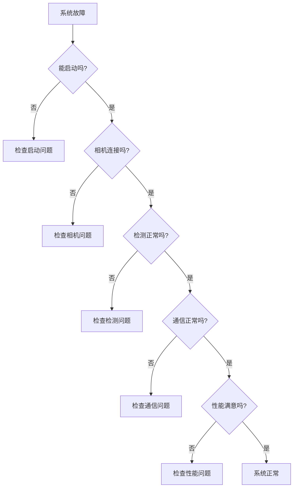

# VisionCore Enterprise Edition - 故障排查手册

> **版本**: v1.3.0  
> **更新日期**: 2025-11-26  
> **文档类型**: 故障排除指南

---

## 📋 目录

- [快速诊断](#快速诊断)
- [启动问题](#启动问题)
- [相机问题](#相机问题)
- [检测问题](#检测问题)
- [通信问题](#通信问题)
- [性能问题](#性能问题)
- [标定问题](#标定问题)
- [日志分析](#日志分析)
- [系统恢复](#系统恢复)
- [联系支持](#联系支持)

---

## 快速诊断

### 诊断流程图



### 健康检查命令

```bash
# 1. 检查系统进程
ps aux | grep python | grep main.py

# 2. 检查端口占用
netstat -tuln | grep 8888    # TCP端口
netstat -tuln | grep 1883    # MQTT端口

# 3. 检查日志
tail -f logs/VisionCorePro_$(date +%Y-%m-%d).log

# 4. 检查相机连通性
ping 192.168.2.99
telnet 192.168.2.99 2122

# 5. 测试TCP连接
python tests/test_tcp_client.py
```

---

## 启动问题

### 问题1: 系统无法启动

#### 症状
```bash
$ python -m app.main
Traceback (most recent call last):
  File "app/main.py", line 18, in <module>
    from app.bootstrap import build_app
ModuleNotFoundError: No module named 'cv2'
```

#### 原因
Python依赖未安装或虚拟环境未激活

#### 解决方案
```bash
# 1. 确认虚拟环境已激活
# Linux/Mac:
source venv/bin/activate
# Windows:
venv\Scripts\activate

# 2. 重新安装依赖
pip install -r requirements.txt

# 3. 验证核心依赖
python -c "import cv2, numpy, ultralytics, yaml; print('✓ 依赖正常')"

# 4. 如果仍失败，重建虚拟环境
rm -rf venv
python -m venv venv
source venv/bin/activate
pip install -r requirements.txt
```

---

### 问题2: 配置文件错误

#### 症状
```
ERROR: 配置文件解析失败
yaml.scanner.ScannerError: mapping values are not allowed here
```

#### 原因
YAML语法错误（缩进、冒号等）

#### 解决方案
```bash
# 1. 验证YAML语法
python -c "import yaml; yaml.safe_load(open('configs/config.yaml'))"

# 2. 常见YAML错误
# ❌ 错误：缩进使用Tab
camera:
	ip: 192.168.2.99

# ✅ 正确：使用2个空格
camera:
  ip: 192.168.2.99

# ❌ 错误：冒号后无空格
camera:
  ip:192.168.2.99

# ✅ 正确：冒号后有空格
camera:
  ip: 192.168.2.99

# 3. 恢复备份配置
cp configs/config_backup/config.yaml.backup_YYYYMMDD_HHMMSS configs/config.yaml
```

---

### 问题3: 模型文件找不到

#### 症状
```
ERROR: 模型文件不存在: models/seasoning_11.18.pt
```

#### 原因
模型文件路径错误或文件缺失

#### 解决方案
```bash
# 1. 检查模型文件
ls -lh models/

# 2. 确认配置文件中的路径
grep "path:" configs/config.yaml

# 3. 如果模型不存在，放置正确的模型文件
# PC平台：.pt文件
# RK3588平台：.rknn文件

# 4. 更新配置文件
nano configs/config.yaml
# 修改 model.path 为实际文件路径
```

---

### 问题4: 端口被占用

#### 症状
```
ERROR: TCP服务器启动失败: [Errno 98] Address already in use
```

#### 原因
端口8888已被其他程序占用

#### 解决方案
```bash
# 1. 查找占用端口的进程
# Linux:
lsof -i :8888
sudo netstat -tulpn | grep 8888

# Windows:
netstat -ano | findstr :8888

# 2. 杀死占用进程
# Linux:
sudo kill -9 <PID>

# Windows:
taskkill /PID <PID> /F

# 3. 或者修改配置使用其他端口
nano configs/config.yaml
# DetectionServer.port: 8889

# 4. 确认端口空闲
telnet localhost 8888
# 应该显示 "Connection refused"（表示端口空闲）
```

---

## 相机问题

### 问题5: 相机无法连接

#### 症状
```
ERROR: 相机连接失败 | 192.168.2.99:2122 | timeout
```

#### 原因分析
1. 网络不通
2. 相机电源未开
3. IP地址配置错误
4. 防火墙阻止

#### 排查步骤
```bash
# 步骤1: 检查网络连通性
ping 192.168.2.99
# ✓ 如果能ping通，说明网络正常
# ✗ 如果不通，检查网线、IP设置

# 步骤2: 检查端口可达性
telnet 192.168.2.99 2122
# ✓ 如果连接成功，说明相机服务正常
# ✗ 如果失败，检查相机电源、服务状态

# 步骤3: 检查PC网卡配置
ifconfig    # Linux
ipconfig    # Windows
# 确认PC的IP与相机在同一网段
# 相机: 192.168.2.99
# PC应该: 192.168.2.x (x≠99)

# 步骤4: 检查配置文件
grep "ip:" configs/config.yaml
# 确认IP地址正确

# 步骤5: 临时禁用防火墙测试
# Linux:
sudo ufw disable

# Windows:
# 控制面板 -> Windows Defender防火墙 -> 关闭
```

#### 解决方案

**方案1: 网络配置**
```bash
# Linux设置静态IP
sudo nano /etc/network/interfaces

# 添加:
auto eth0
iface eth0 inet static
    address 192.168.2.100
    netmask 255.255.255.0

# 重启网络
sudo systemctl restart networking
```

**方案2: 防火墙规则**
```bash
# 允许相机端口
sudo ufw allow from 192.168.2.99 to any port 2122
```

**方案3: 使用C++后端**
```yaml
# configs/config.yaml
camera:
  backend: cpp    # C++实现有时更稳定
```

---

### 问题6: 相机频繁断线

#### 症状
```
WARNING: 相机连接断开，正在重连...
INFO: 相机重连成功
WARNING: 相机连接断开，正在重连...
```

#### 原因
1. 网线质量差
2. 网络不稳定
3. 相机过热
4. 电源不稳定

#### 解决方案
```bash
# 1. 检查网线
# - 更换质量好的超五类/六类网线
# - 确保网线长度<100米
# - 检查水晶头是否松动

# 2. 检查网络设备
# - 使用直连（不经过交换机）
# - 更换交换机
# - 使用千兆交换机

# 3. 检查相机状态
# - 确认相机不过热（风扇正常）
# - 检查相机电源供电稳定

# 4. 增加超时时间
nano configs/config.yaml
camera:
  connection:
    timeout: 30    # 增加超时时间（秒）
```

---

### 问题7: 相机取图慢

#### 症状
```
INFO: 相机取图耗时: 850ms
```

#### 原因
1. 使用Python后端
2. 网络延迟高
3. 相机配置不当

#### 解决方案
```yaml
# 1. 启用C++后端（显著提速）
camera:
  backend: cpp

# 2. 使用单步模式
camera:
  mode:
    useSingleStep: true

# 3. 减少取图内容
# 在代码中只获取必要的数据
frame = camera.get_frame(
    depth=True,       # 必须
    intensity=True,   # 必须
    camera_params=False  # 非必须时关闭
)
```

---

## 检测问题

### 问题8: 检测结果不准确

#### 症状
- 漏检：明明有目标但未检测到
- 误检：检测到不存在的目标
- 位置偏移：检测位置与实际位置偏差大

#### 原因分析

**漏检原因**:
1. 置信度阈值太高
2. 目标尺寸太小
3. 光照条件差
4. 模型未训练该场景

**误检原因**:
1. 置信度阈值太低
2. 背景干扰
3. 模型过拟合

**位置偏移原因**:
1. 标定不准确
2. 相机畸变
3. 深度数据不准

#### 解决方案

**调整检测参数**:
```yaml
# configs/config.yaml
model:
  conf_threshold: 0.5    # 降低阈值减少漏检，升高阈值减少误检
  nms_threshold: 0.45    # NMS阈值，控制重叠框

roi:
  minArea: 2500          # 最小面积，过滤小目标
  depthThreshold: 700    # 深度阈值，过滤过深目标
```

**优化ROI**:
```yaml
roi:
  regions:
    - name: work_area
      width: 150
      height: 100
      offsetx: 50      # 调整ROI位置
      offsety: 40
      priority: 1
```

**测试不同参数**:
```python
# 测试脚本
import json

test_configs = [
    {"conf": 0.5, "nms": 0.4},
    {"conf": 0.6, "nms": 0.45},
    {"conf": 0.7, "nms": 0.5},
]

for cfg in test_configs:
    # 更新配置
    update_config(cfg)
    
    # 测试检测
    result = mqtt_client.model_test()
    
    # 记录结果
    print(f"conf={cfg['conf']}, nms={cfg['nms']}")
    print(f"  检测数量: {result['data']['detection_count']}")
```

---

### 问题9: 检测速度慢

#### 症状
```
INFO: 推理耗时: 850ms
WARNING: 检测总时间超过1秒
```

#### 原因
1. 使用CPU推理（PC）
2. 使用Python后端（RKNN）
3. 图像分辨率太高
4. 模型太大

#### 解决方案

**PC平台优化**:
```bash
# 1. 启用GPU加速
# 确认CUDA可用
python -c "import torch; print(torch.cuda.is_available())"

# 2. 如果CUDA不可用，安装
pip install torch torchvision --index-url https://download.pytorch.org/whl/cu118

# 3. 验证GPU加速生效
# 查看日志应该显示: "Using device: cuda:0"
```

**RK3588平台优化**:
```yaml
# 1. 启用C++后端
model:
  backend: rknn
  use_cpp: true    # 使用C++实现的RKNN推理

# 2. 编译C++模块
cd services/cpp
./build.sh

# 3. 验证C++模块加载
python -c "import vc_detection_cpp; print('✓ C++检测模块可用')"
```

**通用优化**:
```yaml
# 1. 使用更小的模型
model:
  model_name: yolov8n-seg.pt    # n: nano（最快）
  # model_name: yolov8s-seg.pt  # s: small
  # model_name: yolov8m-seg.pt  # m: medium

# 2. 降低输入分辨率（如果模型支持）
model:
  input_size: 320    # 默认640
```

---

### 问题10: 检测器崩溃

#### 症状
```
ERROR: 检测器异常退出
Segmentation fault (core dumped)
```

#### 原因
1. C++模块版本不匹配
2. 内存不足
3. RKNN驱动问题

#### 解决方案
```bash
# 1. 切换到Python后端
nano configs/config.yaml
model:
  use_cpp: false    # 禁用C++后端

# 2. 检查内存
free -h
# 如果可用内存<1GB，考虑：
# - 关闭其他程序
# - 增加swap
# - 使用更小的模型

# 3. 重新编译C++模块
cd services/cpp
./clean.sh
./build.sh

# 4. RK3588平台：检查NPU驱动
ls /dev/rknpu*
dmesg | grep rknpu
```

---

## 通信问题

### 问题11: TCP客户端无法连接

#### 症状
```python
socket.error: [Errno 111] Connection refused
```

#### 排查步骤
```bash
# 1. 确认TCP服务器已启动
grep "TCP 服务器启动" logs/VisionCorePro_*.log

# 2. 确认监听地址和端口
netstat -tuln | grep 8888
# 应该显示: 0.0.0.0:8888 或 192.168.2.126:8888

# 3. 测试本地连接
telnet localhost 8888
# 如果成功，说明服务器正常

# 4. 测试远程连接
telnet 192.168.2.126 8888
# 如果失败，检查防火墙

# 5. 检查配置
grep "DetectionServer" configs/config.yaml -A 5
```

#### 解决方案
```yaml
# 确保监听所有网络接口
DetectionServer:
  enable: true
  host: 0.0.0.0    # 不要用127.0.0.1
  port: 8888
```

---

### 问题12: MQTT连接失败

#### 症状
```
ERROR: MQTT连接失败: Connection Refused
```

#### 原因
1. MQTT broker未运行
2. 配置错误
3. 网络不通

#### 解决方案
```bash
# 1. 确认MQTT broker运行
# 如果使用Mosquitto:
sudo systemctl status mosquitto

# 如果未安装:
sudo apt install mosquitto mosquitto-clients

# 2. 测试MQTT连接
mosquitto_sub -h 192.168.2.126 -t test -v

# 3. 检查配置
grep "mqtt:" configs/config.yaml -A 10

# 4. MQTT是非关键组件，可以禁用
mqtt:
  enable: false
```

---

### 问题13: TCP响应超时

#### 症状
```python
socket.timeout: timed out
```

#### 原因
1. 系统负载高
2. 检测耗时长
3. 网络延迟高

#### 解决方案
```python
# 1. 增加客户端超时时间
client = socket.socket()
client.settimeout(10)    # 增加到10秒

# 2. 检查系统负载
top    # 查看CPU、内存使用率

# 3. 优化检测性能（见问题9）

# 4. 检查遮挡检测
# 如果频繁返回 -1,0,0,0,0，调整遮挡检测参数
roi:
  occlusion:
    intervalThreshold: 1000    # 增加阈值
    ignoreCount: 2             # 减少忽略次数
```

---

## 性能问题

### 问题14: 系统整体响应慢

#### 症状
- TCP响应时间>500ms
- CPU使用率持续>80%
- 内存使用率持续>90%

#### 性能分析
```bash
# 1. 系统资源监控
top -p $(pgrep -f "python.*main.py")

# 2. 详细性能分析
python -m cProfile -o profile.stats app/main.py
# Ctrl+C 停止后分析
python -c "import pstats; p=pstats.Stats('profile.stats'); p.sort_stats('cumulative'); p.print_stats(20)"

# 3. 内存分析
pip install memory_profiler
python -m memory_profiler app/main.py
```

#### 优化方案

**CPU优化**:
```yaml
# 1. 启用GPU/NPU加速
model:
  backend: auto    # PC自动选择GPU

# 2. 减少检查间隔
board_mode:
  monitoring:
    check_interval: 60    # 从30秒增加到60秒

# 3. 禁用非必要功能
sftp:
  enable: false    # 禁用SFTP
mqtt:
  enable: false    # 禁用MQTT（如果不需要）
```

**内存优化**:
```python
# 1. 定期清理缓存（在代码中添加）
import gc
gc.collect()

# 2. 使用更小的模型

# 3. 限制图像缓存
```

**I/O优化**:
```yaml
# 1. 使用SSD存储日志
logging:
  file:
    path: /mnt/ssd/logs    # 如果有SSD

# 2. 减少日志写入
logging:
  level: WARNING    # 从INFO改为WARNING
```

---

### 问题15: 内存泄漏

#### 症状
```bash
# 内存使用持续增长
$ free -h
              total        used        free
Mem:           7.8G        6.5G        200M    # 并持续增长
```

#### 排查方法
```python
# 使用tracemalloc追踪内存
import tracemalloc

tracemalloc.start()

# 运行一段时间后
snapshot = tracemalloc.take_snapshot()
top_stats = snapshot.statistics('lineno')

for stat in top_stats[:10]:
    print(stat)
```

#### 解决方案
```bash
# 1. 重启服务（临时方案）
sudo systemctl restart visioncore

# 2. 定期重启（cron任务）
crontab -e
# 添加：每天凌晨3点重启
0 3 * * * systemctl restart visioncore

# 3. 使用进程监控工具
pip install supervisor
# 配置自动重启策略
```

---

## 标定问题

### 问题16: 标定RMSE过大

**参考**: [标定操作手册 - 常见问题](./标定操作手册.md#常见问题)

---

### 问题17: 标定后抓取偏差

**参考**: [标定操作手册 - Q3](./标定操作手册.md#q3-标定后实际抓取偏差大)

---

## 日志分析

### 日志位置

```bash
# 主日志文件
logs/VisionCorePro_YYYY-MM-DD.log

# 旧日志（自动轮转）
logs/VisionCorePro_YYYY-MM-DD.log.1
logs/VisionCorePro_YYYY-MM-DD.log.2
```

### 日志级别

| 级别 | 含义 | 示例 |
|------|------|------|
| **DEBUG** | 调试信息 | `DEBUG: 进入函数 detect()` |
| **INFO** | 正常信息 | `INFO: TCP服务器启动成功` |
| **WARNING** | 警告 | `WARNING: 相机连接断开，正在重连` |
| **ERROR** | 错误 | `ERROR: 检测器加载失败` |
| **CRITICAL** | 严重错误 | `CRITICAL: 系统无法启动` |

### 常用日志分析命令

```bash
# 1. 实时查看日志
tail -f logs/VisionCorePro_$(date +%Y-%m-%d).log

# 2. 查看错误日志
grep "ERROR" logs/VisionCorePro_*.log

# 3. 查看最近的错误
grep "ERROR" logs/VisionCorePro_*.log | tail -20

# 4. 统计错误类型
grep "ERROR" logs/VisionCorePro_*.log | cut -d':' -f4 | sort | uniq -c

# 5. 查看特定时间段的日志
grep "2025-11-26 14:" logs/VisionCorePro_2025-11-26.log

# 6. 查看检测性能
grep "推理耗时" logs/VisionCorePro_*.log | tail -50
```

### 关键日志标识

**启动成功标识**:
```
INFO: VisionCorePro starting...
INFO: ✓ TCP服务器启动成功
INFO: ✓ 相机连接成功
INFO: ✓ 检测器加载成功
INFO: ✓ 服务已启动，监控器正在运行
```

**相机问题标识**:
```
ERROR: 相机连接失败
WARNING: 相机连接断开
ERROR: 取图失败
WARNING: 检测到旧帧复用
```

**检测问题标识**:
```
ERROR: 检测器未就绪
WARNING: 未检测到目标
ERROR: 推理失败
WARNING: ROI过滤后无目标
```

**性能问题标识**:
```
WARNING: 推理耗时过长: 850ms
WARNING: TCP处理超时
ERROR: 系统内存不足
```

---

## 系统恢复

### 完全重置

```bash
# 1. 停止服务
sudo systemctl stop visioncore

# 2. 备份数据
cp -r configs configs.backup.$(date +%Y%m%d)
cp -r logs logs.backup.$(date +%Y%m%d)

# 3. 恢复默认配置
git checkout configs/config.yaml

# 4. 清理日志
rm logs/*.log

# 5. 清理缓存
find . -type d -name "__pycache__" -exec rm -r {} +

# 6. 重新安装依赖
pip install -r requirements.txt --force-reinstall

# 7. 重启服务
sudo systemctl start visioncore
```

### 配置恢复

```bash
# 方法1: 从备份恢复
ls configs/config_backup/
cp configs/config_backup/config.yaml.backup_YYYYMMDD_HHMMSS configs/config.yaml

# 方法2: 从Git恢复
git checkout configs/config.yaml

# 方法3: 使用最小配置
cat > configs/config.yaml << 'EOF'
logging:
  enable: true
  level: INFO

camera:
  enable: true
  connection:
    ip: 192.168.2.99
    port: 2122

model:
  backend: auto
  path: models/seasoning_11.18.pt
  conf_threshold: 0.7

DetectionServer:
  enable: true
  host: 0.0.0.0
  port: 8888

mqtt:
  enable: false

sftp:
  enable: false

roi:
  enable: true
  minArea: 3000
EOF
```

### 数据恢复

```bash
# 1. 恢复标定矩阵
ls configs/transformation_matrix_backup/
cp configs/transformation_matrix_backup/transformation_matrix.json.backup_YYYYMMDD_HHMMSS \
   configs/transformation_matrix.json

# 2. 恢复模型文件
# 从备份位置复制模型文件
cp /backup/models/*.pt models/
cp /backup/models/*.rknn models/
```

---

## 联系支持

### 提交问题前的准备

1. **收集系统信息**:
```bash
# 创建诊断报告
cat > diagnostic_report.txt << EOF
# 系统信息
OS: $(uname -a)
Python: $(python --version)
VisionCore: v1.3.0

# 硬件信息
CPU: $(lscpu | grep "Model name")
Memory: $(free -h | grep Mem)
GPU: $(nvidia-smi 2>/dev/null || echo "N/A")

# 配置信息
$(cat configs/config.yaml)

# 最近错误日志
$(grep "ERROR\|CRITICAL" logs/VisionCorePro_*.log | tail -50)
EOF

cat diagnostic_report.txt
```

2. **问题描述模板**:
```
问题标题: [简短描述问题]

系统环境:
- 操作系统: Windows 10 / Ubuntu 20.04 / RK3588
- Python版本: 3.9.x
- VisionCore版本: v1.3.0

问题现象:
[详细描述问题，包括错误信息、截图等]

复现步骤:
1. 步骤1
2. 步骤2
3. ...

已尝试的解决方法:
- 方法1: 结果xxx
- 方法2: 结果xxx

附件:
- 日志文件: logs/VisionCorePro_YYYY-MM-DD.log
- 配置文件: configs/config.yaml
- 诊断报告: diagnostic_report.txt
```

### 支持渠道

- **GitHub Issues**: [项目地址]/issues
- **邮件支持**: support@example.com
- **技术文档**: [文档站点]

---

## 附录：常用命令速查

### 系统管理

```bash
# 启动服务
sudo systemctl start visioncore

# 停止服务
sudo systemctl stop visioncore

# 重启服务
sudo systemctl restart visioncore

# 查看状态
sudo systemctl status visioncore

# 查看日志
sudo journalctl -u visioncore -f
```

### 网络诊断

```bash
# 测试相机连通性
ping -c 4 192.168.2.99
telnet 192.168.2.99 2122

# 测试TCP服务器
telnet localhost 8888
nc -zv localhost 8888

# 查看端口占用
netstat -tuln | grep 8888
lsof -i :8888

# 抓包分析
sudo tcpdump -i eth0 host 192.168.2.99 -w camera.pcap
```

### 进程管理

```bash
# 查找进程
ps aux | grep python | grep main.py

# 查看进程详情
pgrep -f "python.*main.py"
ps -p <PID> -o pid,ppid,cmd,%mem,%cpu,etime

# 杀死进程
kill -9 <PID>
pkill -f "python.*main.py"
```

### 性能监控

```bash
# CPU和内存
top -p <PID>
htop -p <PID>

# 磁盘I/O
iotop -p <PID>

# 网络I/O
iftop -i eth0
nethogs eth0

# GPU使用率（NVIDIA）
watch -n 1 nvidia-smi
```

---

<div align="center">

**VisionCore Enterprise Edition**  
*专业工业视觉检测系统*

遇到问题？先查阅本手册 | 无法解决？联系技术支持

返回 [系统安装配置手册](./系统安装配置手册.md) | [API接口使用手册](./API接口使用手册.md) | [标定操作手册](./标定操作手册.md)

</div>

