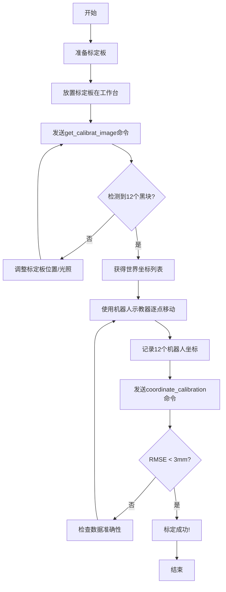

# VisionCore Enterprise Edition - 标定操作手册

> **版本**: v1.3.0  
> **更新日期**: 2025-11-26  
> **难度**: ⭐⭐⭐☆☆（中等）

---

## 📋 目录

- [标定概述](#标定概述)
- [标定前准备](#标定前准备)
- [标定板制作](#标定板制作)
- [标定流程](#标定流程)
- [标定原理](#标定原理)
- [精度验证](#精度验证)
- [常见问题](#常见问题)
- [高级技巧](#高级技巧)

---

## 标定概述

### 什么是坐标标定？

坐标标定是建立**相机坐标系**和**机器人坐标系**之间转换关系的过程。

```
相机坐标系 (Xc, Yc, Zc)  ──标定──→  机器人坐标系 (Xr, Yr, Zr)
     ↓                                      ↓
  检测到的位置                         机器人抓取位置
```

### 为什么需要标定？

1. **坐标系不同**: 相机和机器人使用不同的坐标系
2. **安装误差**: 相机安装位置和角度存在误差
3. **精度要求**: 工业应用需要mm级定位精度

### 标定方法

VisionCore采用**12点标定法**（3行4列网格布局）：

```
标定板布局（俯视图）:

  1 ●    2 ●    3 ●    4 ●
  
  5 ●    6 ●    7 ●    8 ●
  
  9 ●   10 ●   11 ●   12 ●
  
  (● = 黑色标记块)
```

### 标定原理

采用**分离式变换模型**：

- **XY平面**: 仿射变换（6参数）
  - 考虑平移、旋转、缩放
  - 适合平面工件定位

- **Z轴**: 线性变换（2参数）
  - 简单的深度映射
  - 适合固定高度的抓取

**数学模型**:
```
Xr = a11*Xc + a12*Yc + a13
Yr = a21*Xc + a22*Yc + a23
Zr = b1*Zc + b2
```

---

## 标定前准备

### 硬件准备

| 项目 | 说明 | 要求 |
|------|------|------|
| **标定板** | 3行4列黑色标记块 | 见下节制作说明 |
| **固定装置** | 固定标定板在工作台 | 稳定、平整 |
| **机器人** | 支持示教功能 | 能记录坐标 |
| **工具** | 记录本、笔 | 记录机器人坐标 |

### 软件准备

1. **系统运行正常**:
```bash
# 启动VisionCore
python -m app.main

# 确认以下服务正常:
# ✓ 相机连接成功
# ✓ 检测器加载成功
# ✓ TCP/MQTT服务正常
```

2. **MQTT客户端**（推荐使用MQTT Explorer或编写Python脚本）

3. **机器人示教器**（用于移动机器人并记录坐标）

### 环境准备

1. **光照条件**: 
   - 均匀照明，避免强反光
   - 避免标定板上有阴影

2. **工作台**: 
   - 清洁、平整
   - 标定板放置稳定

3. **相机位置**: 
   - 标定板在相机视野中央
   - 所有12个黑块都清晰可见

---

## 标定板制作

### 设计参数

**推荐规格**（根据实际相机视野调整）:

| 参数 | 数值 | 说明 |
|------|------|------|
| **板材尺寸** | 300mm × 200mm | 白色或浅色板材 |
| **黑块尺寸** | 15mm × 15mm | 正方形，黑色 |
| **黑块间距** | 60mm（横向）× 50mm（纵向） | 均匀分布 |
| **布局** | 3行 × 4列 = 12个点 | 矩形网格 |

### 制作方法

#### 方法1: 贴纸法（推荐，简单快速）

```
材料:
- 白色泡沫板或PVC板（300×200mm）
- 黑色电工胶带或黑色贴纸
- 尺子、剪刀

步骤:
1. 在白色板材上用铅笔标记12个位置
2. 剪裁黑色胶带为15×15mm正方形
3. 贴在标记位置上
4. 确保黑块边缘平整
```

#### 方法2: 打印法

```
步骤:
1. 使用绘图软件（如PowerPoint、CAD）绘制标定板图案
2. 打印在A3纸上
3. 裱在硬纸板上
4. 覆膜保护（可选）
```

#### 方法3: 专业制作

```
使用PCB/广告制作厂家制作:
- 亚克力板材 + 黑色喷漆
- 铝板 + 阳极氧化黑色
- 精度更高，耐用性好
```

### 质量要求

✅ **合格标准**:
- 黑块颜色纯黑，与背景对比度高
- 黑块边缘清晰、平整
- 黑块尺寸一致（误差<1mm）
- 黑块位置准确（误差<2mm）
- 表面平整，无翘曲

❌ **不合格情况**:
- 黑块颜色不均匀
- 黑块边缘模糊
- 黑块大小不一致
- 黑块位置偏差大
- 表面有明显划痕或污渍

### 验证标定板

使用 `get_calibrat_image` 命令测试：

```python
# 发送MQTT命令
{
  "command": "get_calibrat_image"
}

# 检查响应
{
  "data": {
    "blocks_count": 12,  # 应该检测到12个
    "world_coords": [...]
  }
}
```

**如果检测到的黑块数量<12**:
- 检查黑块对比度是否足够
- 调整光照条件
- 确认所有黑块在相机视野内

---

## 标定流程

### 完整流程图



### 步骤1: 获取标定图像

**目的**: 检测标定板上的黑块，获取相机坐标系下的世界坐标

**操作**:

1. 将标定板平放在工作台上
2. 调整位置，确保所有黑块都在相机视野内
3. 发送MQTT命令:

```python
import paho.mqtt.client as mqtt
import json
import time

# 连接MQTT
client = mqtt.Client(client_id="calibration_client")
client.connect("192.168.2.126", 1883, 60)
client.loop_start()

# 订阅结果主题
client.subscribe("visual/system/result", qos=2)

# 发送命令
request = {"command": "get_calibrat_image"}
client.publish("visual/system/command", json.dumps(request), qos=2)

# 等待响应
time.sleep(2)
```

4. 查看响应:

```json
{
  "command": "get_calibrat_image",
  "messageType": "success",
  "message": "检测到12个标定点",
  "data": {
    "blocks_count": 12,
    "world_coords": [
      {"id": 0, "x": 23.45, "y": 45.23, "z": -38.56},
      {"id": 1, "x": 54.32, "y": 43.87, "z": -37.92},
      {"id": 2, "x": 85.21, "y": 42.56, "z": -37.45},
      {"id": 3, "x": 116.34, "y": 41.23, "z": -36.89},
      {"id": 4, "x": 22.87, "y": 78.45, "z": -38.12},
      {"id": 5, "x": 53.98, "y": 77.12, "z": -37.56},
      {"id": 6, "x": 84.76, "y": 75.89, "z": -37.01},
      {"id": 7, "x": 115.89, "y": 74.45, "z": -36.45},
      {"id": 8, "x": 22.34, "y": 111.67, "z": -37.89},
      {"id": 9, "x": 53.45, "y": 110.34, "z": -37.23},
      {"id": 10, "x": 84.23, "y": 109.01, "z": -36.78},
      {"id": 11, "x": 115.45, "y": 107.67, "z": -36.12}
    ],
    "filename": "calib_20251126_143045_123.jpg",
    "remote_path": "D://Camera/calib_20251126_143045_123.jpg"
  }
}
```

5. **重要**: 保存这12个世界坐标（复制到文本文件）

**检查项**:
- ✅ `blocks_count` 应该等于 12
- ✅ `world_coords` 包含12个坐标
- ✅ 查看SFTP上传的图像，确认黑块检测正确

---

### 步骤2: 记录机器人坐标

**目的**: 使用机器人示教器移动到标定板的每个黑块中心，记录机器人坐标

**操作**:

1. **准备记录表格**:

```
┌────┬──────────┬──────────┬──────────┐
│ ID │   Xr     │   Yr     │   Zr     │
├────┼──────────┼──────────┼──────────┤
│ 0  │          │          │          │
│ 1  │          │          │          │
│ 2  │          │          │          │
│ 3  │          │          │          │
│ 4  │          │          │          │
│ 5  │          │          │          │
│ 6  │          │          │          │
│ 7  │          │          │          │
│ 8  │          │          │          │
│ 9  │          │          │          │
│ 10 │          │          │          │
│ 11 │          │          │          │
└────┴──────────┴──────────┴──────────┘
```

2. **移动机器人到第0个点**（左上角第1个黑块）:
   - 使用示教器手动移动机器人
   - 确保机器人末端工具（如吸盘中心）对准黑块中心
   - 记录此时的机器人坐标（从示教器读取）
   - 例如: X=363.30, Y=-110.74, Z=-85.00

3. **依次移动到其余11个点**:
   - 按照ID顺序: 1, 2, 3, ..., 11
   - 每到一个点，记录机器人坐标
   - **注意**: ID顺序与视觉检测的顺序一致（从左到右，从上到下）

4. **完成后的记录示例**:

```
┌────┬──────────┬──────────┬──────────┐
│ ID │   Xr     │   Yr     │   Zr     │
├────┼──────────┼──────────┼──────────┤
│ 0  │  363.30  │ -110.74  │  -85.00  │
│ 1  │  385.12  │ -142.56  │  -84.23  │
│ 2  │  407.45  │ -174.32  │  -83.56  │
│ 3  │  429.67  │ -206.12  │  -82.89  │
│ 4  │  361.87  │  -78.45  │  -84.12  │
│ 5  │  383.98  │ -110.23  │  -83.45  │
│ 6  │  406.12  │ -142.01  │  -82.78  │
│ 7  │  428.34  │ -173.89  │  -82.12  │
│ 8  │  360.45  │  -46.23  │  -83.23  │
│ 9  │  382.67  │  -78.01  │  -82.56  │
│ 10 │  404.89  │ -109.78  │  -81.89  │
│ 11 │  427.12  │ -141.56  │  -81.23  │
└────┴──────────┴──────────┴──────────┘
```

**注意事项**:
- ⚠️ **确保ID顺序一致**: 机器人坐标的顺序必须与世界坐标的顺序完全对应
- ⚠️ **记录准确**: 机器人坐标小数点后至少2位
- ⚠️ **避免碰撞**: 移动机器人时小心不要碰到标定板
- ⚠️ **保持Z轴一致**: 每个点的Z轴高度应该接近（因为标定板是平的）

---

### 步骤3: 执行标定

**目的**: 将世界坐标和机器人坐标发送给系统，计算变换矩阵

**操作**:

1. **准备数据**:

```python
# 世界坐标（从步骤1获得）
world_points = [
    [23.45, 45.23, -38.56],
    [54.32, 43.87, -37.92],
    [85.21, 42.56, -37.45],
    [116.34, 41.23, -36.89],
    [22.87, 78.45, -38.12],
    [53.98, 77.12, -37.56],
    [84.76, 75.89, -37.01],
    [115.89, 74.45, -36.45],
    [22.34, 111.67, -37.89],
    [53.45, 110.34, -37.23],
    [84.23, 109.01, -36.78],
    [115.45, 107.67, -36.12]
]

# 机器人坐标（从步骤2记录）
robot_points = [
    [363.30, -110.74, -85.00],
    [385.12, -142.56, -84.23],
    [407.45, -174.32, -83.56],
    [429.67, -206.12, -82.89],
    [361.87, -78.45, -84.12],
    [383.98, -110.23, -83.45],
    [406.12, -142.01, -82.78],
    [428.34, -173.89, -82.12],
    [360.45, -46.23, -83.23],
    [382.67, -78.01, -82.56],
    [404.89, -109.78, -81.89],
    [427.12, -141.56, -81.23]
]
```

2. **发送标定命令**:

```python
# 构建请求
request = {
    "command": "coordinate_calibration",
    "data": {
        "world_points": world_points,
        "robot_points": robot_points
    }
}

# 发送MQTT命令
client.publish("visual/system/command", json.dumps(request), qos=2)

# 等待响应
time.sleep(3)
```

3. **查看标定结果**:

```json
{
  "command": "coordinate_calibration",
  "messageType": "success",
  "message": "标定成功",
  "data": {
    "transformation_matrix": [
      [0.9876, -0.1234, 0.0056, 340.23],
      [0.1235, 0.9875, -0.0023, -95.67],
      [0.0034, 0.0045, 0.9999, -45.12],
      [0.0000, 0.0000, 0.0000, 1.0000]
    ],
    "rmse": {
      "xy": 2.34,
      "z": 3.21,
      "overall": 2.67
    },
    "quality": "优秀",
    "backup_file": "transformation_matrix.json.backup_20251126_143045"
  }
}
```

4. **解读结果**:

| 字段 | 含义 | 说明 |
|------|------|------|
| `transformation_matrix` | 4×4变换矩阵 | 用于后续坐标转换 |
| `rmse.xy` | XY平面RMSE（mm） | 平面定位误差 |
| `rmse.z` | Z轴RMSE（mm） | 深度误差 |
| `rmse.overall` | 整体RMSE（mm） | 综合误差 |
| `quality` | 质量评级 | 优秀/良好/合格/需改进 |

---

### 步骤4: 验证标定

**目的**: 测试标定精度，确保坐标转换正确

**方法1: 使用已知点验证**

```python
# 1. 放置一个测试物体在工作台上
# 2. 执行catch命令获取机器人坐标
result = tcp_client.catch()
x, y, z = result['coords']

# 3. 移动机器人到该坐标
robot.move_to(x, y, z)

# 4. 观察机器人是否准确到达目标位置
# ✓ 偏差<5mm: 标定良好
# ✗ 偏差>10mm: 需重新标定
```

**方法2: 多点测试**

```python
# 在工作台不同位置放置测试物体
test_positions = [
    "左上角", "右上角", "左下角", "右下角", "中央"
]

for position in test_positions:
    print(f"测试位置: {position}")
    input("放置测试物体，按Enter继续...")
    
    result = tcp_client.catch()
    if result['success']:
        x, y, z = result['coords']
        print(f"检测坐标: X={x:.2f}, Y={y:.2f}, Z={z:.2f}")
        input("移动机器人验证，按Enter继续...")
```

---

## 标定原理

### 坐标系定义

```
相机坐标系（世界坐标）:
        Y
        ↑
        |
        |
        └────→ X
       /
      /
     ↓
     Z (深度)

机器人坐标系:
     X (工作台长边方向)
     ↑
     |
     |
     └────→ Y (工作台短边方向)
    /
   /
  ↓
  Z (垂直向下)
```

### 变换模型

#### XY平面仿射变换

```
[ Xr ]   [ a11  a12  a13 ] [ Xc ]
[ Yr ] = [ a21  a22  a23 ] [ Yc ]
[ 1  ]   [ 0    0    1   ] [ 1  ]
```

**参数含义**:
- `a11, a22`: 缩放因子
- `a12, a21`: 旋转和剪切
- `a13, a23`: 平移量

#### Z轴线性变换

```
Zr = b1 * Zc + b2
```

**参数含义**:
- `b1`: 深度缩放因子
- `b2`: 深度偏移量

### 求解方法

使用**最小二乘法**求解变换参数：

```python
# 伪代码
def fit_affine_transform(world_points, robot_points):
    # 构建线性方程组 A*x = b
    A = build_matrix(world_points)
    b = robot_points
    
    # 求解 x = (A^T*A)^(-1) * A^T * b
    x = np.linalg.lstsq(A, b)
    
    return x
```

### RMSE计算

**均方根误差（Root Mean Square Error）**:

```
RMSE = √( Σ(predicted - actual)² / n )
```

**Python实现**:
```python
def calculate_rmse(predicted, actual):
    diff = predicted - actual
    squared_diff = diff ** 2
    mean_squared = np.mean(squared_diff)
    rmse = np.sqrt(mean_squared)
    return rmse
```

---

## 精度验证

### 质量评级标准

| 评级 | XY RMSE | Z RMSE | 整体RMSE | 适用场景 |
|------|---------|--------|----------|---------|
| **优秀** | <2mm | <3mm | <3mm | 高精度抓取 |
| **良好** | 2-4mm | 3-5mm | 3-5mm | 一般工业应用 |
| **合格** | 4-7mm | 5-8mm | 5-8mm | 低精度应用 |
| **需改进** | >7mm | >8mm | >8mm | 需重新标定 |

### 影响精度的因素

1. **标定板质量**:
   - 黑块对比度
   - 黑块位置准确性
   - 表面平整度

2. **环境因素**:
   - 光照均匀性
   - 工作台稳定性
   - 相机固定稳定性

3. **操作因素**:
   - 机器人示教准确性
   - 坐标记录准确性
   - ID顺序对应关系

4. **系统因素**:
   - 相机精度
   - 检测算法精度
   - 机器人重复定位精度

### 提高精度的方法

#### 方法1: 增加标定点

```yaml
# 使用4行6列=24点标定（更高精度）
grid:
  rows: 4
  cols: 6
  total: 24
```

#### 方法2: 多次标定取平均

```python
# 执行3次标定，使用平均变换矩阵
matrices = []
for i in range(3):
    result = calibrate()
    matrices.append(result['transformation_matrix'])

# 平均
avg_matrix = np.mean(matrices, axis=0)
```

#### 方法3: 使用更高质量的标定板

- 专业PCB标定板
- 陶瓷标定板
- 精密加工的金属标定板

---

## 常见问题

### Q1: 检测不到12个黑块

**可能原因**:
1. 黑块对比度不够
2. 光照条件差
3. 黑块超出相机视野
4. 黑块被遮挡

**解决方案**:
```yaml
# 调整检测参数（如果需要）
calibration:
  black_threshold: 80      # 降低阈值，更容易检测
  min_area: 100            # 降低最小面积
  max_area: 2000           # 增加最大面积
```

### Q2: RMSE过大（>10mm）

**可能原因**:
1. ID顺序不对应
2. 机器人坐标记录错误
3. 标定板移动了
4. 相机焦距不准

**排查步骤**:
```python
# 1. 检查数据对应关系
print("世界坐标点0:", world_points[0])
print("机器人坐标点0:", robot_points[0])
# 确认这两个点是同一个物理位置

# 2. 重新记录机器人坐标
# 使用更高精度的示教方法

# 3. 固定标定板
# 使用胶带或夹具固定

# 4. 重新标定
```

### Q3: 标定后实际抓取偏差大

**可能原因**:
1. 机器人末端工具中心点(TCP)未正确设置
2. 工件高度与标定板不同
3. 相机安装松动

**解决方案**:
```python
# 1. 检查机器人TCP设置
robot.set_tcp([0, 0, tool_length, 0, 0, 0])

# 2. 补偿Z轴偏移
z_offset = workpiece_height - calibration_board_height
z_corrected = z_detected + z_offset

# 3. 重新固定相机并标定
```

### Q4: 不同区域精度不一致

**原因**: 相机畸变，边缘区域精度低

**解决方案**:
```yaml
# 1. 使用ROI限制工作区域
roi:
  regions:
    - name: high_precision_area
      width: 150
      height: 100
      offsetx: 50    # 避开边缘
      offsety: 40

# 2. 使用相机畸变校正（高级功能）
camera:
  distortion_correction: true
```

### Q5: Z轴精度特别差

**原因**: 深度图像噪声，或Z轴模型不合适

**解决方案**:
```python
# 1. 启用深度滤波
camera:
  depth_filter: true
  filter_size: 5

# 2. 使用更多标定点
# 增加行数，提高Z轴采样密度

# 3. 检查相机深度精度
# 使用已知高度的物体验证
```

---

## 高级技巧

### 自动化标定脚本

```python
#!/usr/bin/env python
# -*- coding: utf-8 -*-
"""
自动化标定脚本
前提：机器人支持程序化移动
"""

import json
import time
from vision_mqtt_client import VisionCoreMQTTClient

def auto_calibration(robot_controller):
    # 1. 连接视觉系统
    vision = VisionCoreMQTTClient("192.168.2.126")
    vision.connect()
    
    # 2. 获取标定图像
    print("步骤1: 获取标定图像...")
    result = vision.send_command("get_calibrat_image")
    
    if result['messageType'] != 'success':
        print("✗ 获取标定图像失败")
        return False
    
    world_points = []
    for block in result['data']['world_coords']:
        world_points.append([block['x'], block['y'], block['z']])
    
    print(f"✓ 检测到{len(world_points)}个标定点")
    
    # 3. 自动示教（需要机器人支持）
    print("步骤2: 自动示教...")
    robot_points = []
    
    for i, wc in enumerate(world_points):
        print(f"移动到点{i}...")
        
        # 粗略移动（基于上次标定结果）
        rough_robot_coord = rough_transform(wc)
        robot_controller.move_to(rough_robot_coord)
        
        # 精确搜索（使用视觉反馈）
        fine_robot_coord = fine_search(robot_controller, vision)
        robot_points.append(fine_robot_coord)
        
        print(f"✓ 点{i}: {fine_robot_coord}")
    
    # 4. 执行标定
    print("步骤3: 执行标定...")
    calib_result = vision.send_command("coordinate_calibration", {
        "world_points": world_points,
        "robot_points": robot_points
    })
    
    if calib_result['messageType'] == 'success':
        rmse = calib_result['data']['rmse']['overall']
        print(f"✓ 标定成功! RMSE={rmse:.2f}mm")
        return True
    else:
        print(f"✗ 标定失败: {calib_result['message']}")
        return False

def rough_transform(world_coord):
    """使用上次标定结果进行粗略变换"""
    # 加载上次的变换矩阵
    matrix = load_previous_matrix()
    robot_coord = apply_transform(matrix, world_coord)
    return robot_coord

def fine_search(robot, vision):
    """使用视觉反馈进行精确搜索"""
    # 实现视觉伺服，精确对准黑块中心
    # （高级功能，需要机器人和视觉系统紧密配合）
    pass

if __name__ == "__main__":
    auto_calibration(robot_controller)
```

### 标定质量分析

```python
def analyze_calibration_quality(world_points, robot_points, matrix):
    """分析标定质量"""
    
    # 1. 计算每个点的误差
    errors = []
    for wc, rc in zip(world_points, robot_points):
        predicted = apply_transform(matrix, wc)
        error = np.linalg.norm(predicted - rc)
        errors.append(error)
    
    # 2. 找出异常点（误差>2倍RMSE的点）
    rmse = np.sqrt(np.mean(np.array(errors)**2))
    outliers = []
    for i, err in enumerate(errors):
        if err > 2 * rmse:
            outliers.append({
                'id': i,
                'error': err,
                'world_coord': world_points[i],
                'robot_coord': robot_points[i]
            })
    
    # 3. 生成报告
    report = {
        'rmse': rmse,
        'max_error': max(errors),
        'min_error': min(errors),
        'outliers': outliers
    }
    
    return report

# 使用
report = analyze_calibration_quality(world_points, robot_points, matrix)
print(json.dumps(report, indent=2))

# 如果有异常点，重新记录这些点的机器人坐标
for outlier in report['outliers']:
    print(f"⚠ 点{outlier['id']}误差过大: {outlier['error']:.2f}mm")
    print("  建议重新示教此点")
```

### 在线标定（运行中标定）

```python
def online_calibration():
    """
    在线标定：系统运行过程中持续优化标定参数
    每次成功抓取后，使用实际抓取位置更新标定
    """
    
    calibration_samples = []
    
    while True:
        # 1. 检测目标
        result = vision.catch()
        if not result['success']:
            continue
        
        detected_coord = result['world_coords']
        predicted_robot_coord = result['robot_coords']
        
        # 2. 机器人抓取
        robot.grasp(predicted_robot_coord)
        
        # 3. 获取实际抓取位置
        actual_robot_coord = robot.get_actual_position()
        
        # 4. 记录样本
        calibration_samples.append({
            'world': detected_coord,
            'robot': actual_robot_coord
        })
        
        # 5. 每收集50个样本，更新标定
        if len(calibration_samples) >= 50:
            update_calibration(calibration_samples)
            calibration_samples = calibration_samples[-20:]  # 保留最近20个
```

---

## 标定记录表

### 标定数据记录表

```
━━━━━━━━━━━━━━━━━━━━━━━━━━━━━━━━━━━━━━━━━━━━━
          VisionCore 标定记录表
━━━━━━━━━━━━━━━━━━━━━━━━━━━━━━━━━━━━━━━━━━━━━

标定日期: ___________    操作员: ___________

相机型号: ___________    序列号: ___________

机器人型号: _________    工作台编号: ______

━━━━━━━━━━━━━━━━━━━━━━━━━━━━━━━━━━━━━━━━━━━━━
世界坐标（相机坐标系）
━━━━━━━━━━━━━━━━━━━━━━━━━━━━━━━━━━━━━━━━━━━━━
ID  |    Xc     |    Yc     |    Zc     |
----+-----------+-----------+-----------+
 0  |           |           |           |
 1  |           |           |           |
 2  |           |           |           |
 3  |           |           |           |
 4  |           |           |           |
 5  |           |           |           |
 6  |           |           |           |
 7  |           |           |           |
 8  |           |           |           |
 9  |           |           |           |
10  |           |           |           |
11  |           |           |           |

━━━━━━━━━━━━━━━━━━━━━━━━━━━━━━━━━━━━━━━━━━━━━
机器人坐标（机器人坐标系）
━━━━━━━━━━━━━━━━━━━━━━━━━━━━━━━━━━━━━━━━━━━━━
ID  |    Xr     |    Yr     |    Zr     |
----+-----------+-----------+-----------+
 0  |           |           |           |
 1  |           |           |           |
 2  |           |           |           |
 3  |           |           |           |
 4  |           |           |           |
 5  |           |           |           |
 6  |           |           |           |
 7  |           |           |           |
 8  |           |           |           |
 9  |           |           |           |
10  |           |           |           |
11  |           |           |           |

━━━━━━━━━━━━━━━━━━━━━━━━━━━━━━━━━━━━━━━━━━━━━
标定结果
━━━━━━━━━━━━━━━━━━━━━━━━━━━━━━━━━━━━━━━━━━━━━
RMSE (XY):    ________ mm
RMSE (Z):     ________ mm
RMSE (整体):  ________ mm

质量评级:    □ 优秀  □ 良好  □ 合格  □ 需改进

备注:
_________________________________________________
_________________________________________________
_________________________________________________

签名: __________    审核: __________
```

---

<div align="center">

**VisionCore Enterprise Edition**  
*专业工业视觉检测系统*

标定完成后，阅读 [故障排查手册](./故障排查手册.md)

</div>

